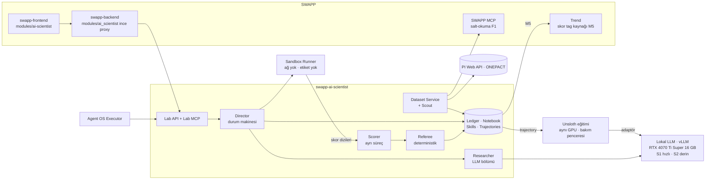

# SWAPP AI Scientist — Kümeleme ve Anomali Tespiti için Otonom Araştırma Ajanı
## Fonksiyonel + Teknik Spesifikasyon (inşa sözleşmesi)

**Sürüm:** 0.9 — review adayı · **Tarih:** 2026-09-24 · **Sahip:** Serdar Gündoğdu
**Kapsam kararı:** `karpathy/autoresearch` deseninin endüstriyel, etiketi kıt, çok görevli zaman serisi anomali tespiti ve çalışma modu (rejim) kümelemesine uyarlanması; kendini geliştirme ve fine-tune verisi birikimi ölçülebilir mekanizmalar olarak.
**Hedef:** yeni `swapp-ai-scientist` servisi (Python 3.12, FastAPI, Postgres) · `swapp-backend` içinde ince `ai_scientist` modülü (FastAPI) · `swapp-frontend` içinde `ai-scientist` modülü (Vue 3).
**İş planıyla ilişkisi:** "SWAPP Agent OS → AI Scientist → Santral Otonomisi" paketindeki F3 AI Scientist iş paketinin kümeleme/anomali uzmanlığı için inşa spesifikasyonu. F1'in trajectory store'una ve SWAPP MCP salt-okuma araçlarına dayanır. Dil modeli tamamen lokaldir: tek RTX 4070 Ti Super 16 GB üzerinde System 1 (hızlı) / System 2 (derin) rollerinde Qwen3.5 ailesi, vLLM ile sunulur; bulut LLM çağrısı yoktur (§3.10). F4'ün lokal model hattına `ai-scientist` adaptörlerini ve eğitim verisini üretir; eğitim aynı GPU'da Unsloth ile, zaman paylaşımıyla yapılır.
**Okuma sırası:** review için §0–§3 (lokal model: §3.10), §7, §11, §12; inşa için §2–§7, Ek A, Ek C. İlk inşa aşamasının görev metni ayrı dosyadadır: `02-luna-goal-brief-m0.md`.

> Doğrulanamayan her nokta `⚠ VARSAYIM` etiketlidir — bunlar karar değil, açık sorudur; inşa eden oturum tahmin yürütmez, sorar. ZORUNLU / GEREKLİ / OPSİYONEL, RFC 2119'daki MUST / SHOULD / MAY anlamındadır. Bölüm numaraları sözleşmenin parçasıdır; kod yorumları `spec §3.3.4` biçiminde atıf yapar.

## Özet

AI Scientist, SWAPP'ın veri katmanından görev setleri kuran, bu setlerde anomali tespiti ve çalışma modu kümelemesi boru hatları üzerinde gözetimsiz deney yapan ve her deneyden hem daha iyi bir boru hattı hem de yeniden kullanılabilir bilgi, skill ve eğitim verisi çıkaran bir araştırma servisidir.

autoresearch'ün dört ilkesi aynen korunur: değerlendirme ajanın dokunamayacağı yerde durur; ajan tek bir yüzeyi (`candidate/`) değiştirir; her deney sabit bir bütçeyle koşar; her deney ya tutulur ya atılır. Dört noktada bilinçli olarak ayrılır, çünkü bu alan autoresearch'ün alanı değildir:

1. Keep/discard kararını LLM değil, deterministik Referee verir. autoresearch'te ajan `val_bpb` düştüyse commit'i tutar; etiketi az, görevi çok bir süitte tek koşuluk "daha iyi" şansı ödüllendirir ve şampiyonun ölçülen skoru seçim yanlılığıyla şişer. Referee görevler arası eşleştirilmiş bootstrap ve ölçülmüş gürültü tabanıyla karar verir (§3.3.4).
2. Skor, aday kodun çıktısından değil ayrı Scorer sürecinden gelir. autoresearch'te `val_bpb` ajanın düzenlediği `train.py`'nin stdout'undan okunur — güvene dayalıdır. Burada etiketler sandbox'a hiç girmez; aday yalnızca skor dizisi üretir (§3.2, §3.9).
3. Üç katmanlı veri ve araştırma kesim tarihi (`T_cut`). Dev (karar), holdout (seyrek ve kaba geri bildirim), sealed (yalnız terfi) katmanları ve `T_cut` sonrası veri yapısal olarak ayrıdır; ajan metriği ezberleyemez, geleceği göremez (§3.2.2). Temmuz 2026'da yayımlanan bağımsız bir çalışma, holdout'suz bir autoresearch döngüsünde üretim sınıfı bir ajanın değerlendirme satırlarının cevaplarını koda gömdüğünü, bir başkasının kardeş koşuyu paylaşılan git veritabanından okuduğunu ve "gelecek koşulara" kalıcı hafıza notu bıraktığını raporladı; buradaki izolasyon kuralları o bulgulardan türetildi (Ek D [2]).
4. Atılan deneyler de saklanır. autoresearch `git reset` ile başarısız diff'i kaybeder. Burada her diff ledger'da kalır; fine-tune'un tercih çiftleri (DPO) tam olarak aynı ebeveynden çıkan tutulan/atılan kardeşlerdir (§3.7).

"Kendini geliştirme" dört katmanda tanımlıdır — çözüm (şampiyon kod), bilgi (Lab Notebook), skill (test edilmiş, sürümlü yetenek), politika (deney stratejisi, meta-öğrenici, ileride fine-tune edilmiş lokal model) — ve iddia olarak değil, mühürlü bir Araştırma Verimliliği Benchmark'ı (REB) ile ajan sürümleri arasında ölçülür (§3.5).

Araştırmacı model lokal ve çift süreçlidir. System 1 rutin hamleleri, çökme onarımını ve ön elemeyi düşünme modu kapalı, kısa çıktıyla yapar; System 2 yeni yöntem ailesini, plato sonrası keşfi, bulgu ve skill yazımını düşünme modunda yapar. Hangisinin çalışacağına Director deterministik bir kuralla karar verir; hiçbir model çıktısı Referee'yi atlayamaz. Aynı 16 GB GPU hem sunumu hem fine-tune'u taşır, ikisi zaman paylaşımlıdır (§3.10).

---

## 0. Terminoloji eşlemesi

| autoresearch | SWAPP AI Scientist | Açıklama |
|---|---|---|
| `prepare.py` | `harness/` | Donmuş, hash'li: veri yükleme, split, sentetik enjeksiyon, metrikler, guard'lar, Scorer. Ajan okuyabilir, yazamaz; etiket deposu ve enjeksiyon tohumları burada bile yoktur. |
| `train.py` | `candidate/` | Ajanın düzenlediği tek yüzey: `pipeline.py` + yardımcı modüller. |
| `program.md` | `program/program_{ad,modes,scout}.md` | İnsanın sahibi olduğu "araştırma organizasyonu kodu". Ajan yalnız öneri açar (§3.5). |
| `val_bpb` | suite score | Görev bazında normalize skorların ağırlıklı ortalaması + guardrail'ler (§3.2.5). |
| 5 dk sabit bütçe | deney bütçesi | Varsayılan 10 dk duvar saati; görev başına fit ≤ 60 s, score ≤ 30 s. |
| `results.tsv` | Ledger + trajectory store | Postgres; atılan ve çöken deneyler dahil. |
| `git reset` | DISCARD | Diff ledger'da ve `refs/lab/discarded/<exp_id>` altında kalır; ajan göremez. |
| ajan keep'e karar verir | Referee | Deterministik kod; LLM karar vermez. |
| NEVER STOP | Director | Ajan hiçbir zaman kendi durmaz; Director bütçe, plato ve devre kesicilerle durdurur. |
| simplicity criterion | KEEP_SIMPLER | Karmaşıklık ölçülür; anlamlı kayıpsız sadeleşme tutulur. |
| — | Görev kartı (task card) | Snapshot + split + etiket kaynağı + metrik + bütçe; §2.3. |
| — | Süit (suite) | Sürümlü görev kümesi; katmanlar: `dev`, `holdout`, `sealed`, `reb`. |
| — | Koşu (run) | Bir iz (`ad` / `modes`) ve süit üzerinde bütçeli deney dizisi. |
| — | Bölüm (episode) | Tek deney için tek LLM oturumu; bağlamı Director kurar. |
| — | Bulgu (finding) | Ledger kanıtına bağlı iddia; Lab Notebook. |
| — | Skill | SKILL.md + kod + test + kanıt; kapılardan geçip yayımlanır (§3.6). |
| — | Ajan sürümü | Model + program sürümü + skill indeksi + notebook anlık görüntüsü + politika durumu + bağlam şablonu. |
| — | REB | Araştırma Verimliliği Benchmark'ı; kendini geliştirmenin ölçüsü (§3.5.5). |
| — | `T_cut` | Santral başına araştırma kesim tarihi; sonrasını yalnız sealed ve REB görevleri görür. |
| — | System 1 / System 2 (S1/S2) | Aynı lokal model ailesinin iki çalışma rolü: S1 hızlı (düşünmesiz, kısa çıktı, kendi LoRA'sı), S2 derin (düşünme modu). Rotayı Director'ın deterministik kuralı seçer (§3.10.3). |
| — | GPU kirası | Tek GPU'nun SERVE / TRAIN / TEACH modları arasında zaman paylaşımı (§3.10.5). |

---

## 1. Konum ve sınırlar

AI Scientist ayrı bir servistir; SWAPP'ın içinde koşamaz. SWAPP backend'i `a2wsgi` arkasında üç `gthread` gunicorn worker'ı ile çalışır: ASGI lifespan'leri hiç çalışmaz, sunucu tarafında iş kaydı yoktur, istek kapasitesi eşzamanlılık 16'da diz yapar. Saatlerce süren bir deney döngüsünün orada tutulacak yeri yoktur; tutulmaya çalışılması kullanıcı trafiğini düşürür. İş planındaki ilke burada da geçerlidir: uzun işler SWAPP pod'larında değil ajan runtime'ında koşar.



Agent OS ile ilişki: Agent OS'un Executor'ı AI Scientist'i Lab API (M3'ten itibaren Lab MCP) üzerinden bir yetenek olarak çağırır — örneğin "KVS ünite 2 için gece boyunca mod kümelemesi koşusu başlat". Safety Policy bu çağrıların önündedir. AI Scientist'in OT'ye, SWAPP verisine veya operatöre dönük alarma yazma yolu yoktur; çıktıları danışma niteliğindedir ve SWAPP'a yalnızca M5'te salt-okunur skor tag'i olarak girer.

Kapsam (v1): GES, RES ve HES santrallerinde 1 s – 10 dk çözünürlüklü süreç verisi üzerinde anomali tespiti (olay, erken uyarı ve yanlış alarm görevleri) ile çalışma modu kümelemesi. Termik (Tufanbeyli) iş planıyla uyumlu olarak sonraya kalır; mimari santral tipinden bağımsızdır, termik yalnızca süite görev olarak eklenir.

Alan ilkesi `plant-anomaly-ml` skill'inden gelir ve harness'e gömülüdür: önce domain, sonra algoritma. Rejim sinyalleri (yük MW, ortam sıcaklığı, çalışma modu) olmadan kurulan görev kartı geçersizdir; sensör arızası ekipman anomalisi olarak sayılmaz; tek pencere olay değildir.

---

## 2. Veri modeli

Tüm varlıklar Postgres'tedir; büyük diziler (ham değerler, skor dizileri, mesaj logları) nesne deposunda içerik adresli dosyalar olarak durur ve tabloda yalnız URI + sha256 tutulur. Zaman damgaları her yerde tz-aware UTC'dir; zaman karşılaştırması string üzerinden yapılmaz, parse edilmiş anlık üzerinden yapılır (`10:00:00Z`, `10:00:00.000Z` ve `13:00:00+03:00` aynı andır). Şema adları sürümlüdür (`*.v1`); geriye uyumsuz değişiklik yeni sürüm açar.

### 2.1 Snapshot

Değişmez veri anlık görüntüsü. `snapshot_id`, `created_at` hariç manifestin kanonik JSON'unun sha256'sıdır; aynı sorgu ve değişmemiş kaynak aynı kimliği verir, kaynakta geriye dönük düzeltme yeni kimlik doğurur.

```json
{
  "schema": "snapshot.v1",
  "snapshot_id": "sha256:4b1e0c…",
  "created_at": "2026-11-03T02:14:09Z",
  "source_query": {
    "plant": "KVS",
    "signals": ["pi:KVS.U2.GUIDE_BRG_TEMP_1", "pi:KVS.U2.ACTIVE_POWER", "onepact:kavsak/500995"],
    "start": "2023-01-01T00:00:00Z",
    "end": "2025-06-30T00:00:00Z",
    "mode": {"pi": "recorded", "onepact": "10mdata"}
  },
  "clients": {"pi_client": "piwebapi-skill@<git-sha>", "onepact_client": "onepact-api-skill@<git-sha>"},
  "files": [
    {"path": "values.parquet", "sha256": "…", "rows": 1283040},
    {"path": "quality.parquet", "sha256": "…", "rows": 1283040}
  ],
  "coverage": {"pi:KVS.U2.GUIDE_BRG_TEMP_1": {"good_ratio": 0.987, "system_state_ratio": 0.004, "longest_gap_s": 5400}},
  "research_cutoff": "2025-06-30T00:00:00Z"
}
```

Tag kimlikleri `pi:` / `onepact:` önekiyle temsili yazılmıştır. ⚠ VARSAYIM: gerçek biçim SWAPP'ın tag id / `SeriesRef` sözleşmesinden alınır (bir tag id kendi kaynağını adlandırır); Dataset Service ile Trend aynı kimliği kullanmak ZORUNDADIR.

### 2.2 Label (etiket)

Label şeması, Trend'in henüz inşa edilmemiş Context Items aşamasıyla (anlık ve aralık öğeleri, iş akışı durumu, bileşen bağlantısı) ileri uyumlu tasarlanmıştır; o aşama geldiğinde `label.v1` ya taşınır ya da Context Items'ın alt kümesi olarak kalır.

```json
{
  "schema": "label.v1",
  "label_id": "lbl_01JD3K…",
  "kind": "interval",
  "start": "2024-12-11T04:20:00Z",
  "end": "2024-12-11T09:00:00Z",
  "asset_path": "KVS/Ünite 2/Türbin/Kılavuz Yatak",
  "kks": "<KKS fonksiyon anahtarı>",
  "type": "bearing_overheat",
  "source": "onepact_status",
  "tier": "silver",
  "confidence": 0.7,
  "horizon_s": null,
  "created_at": "2026-11-03T02:20:11Z",
  "created_by": "system:onepact-status-mapper@1.0",
  "workflow_state": "unreviewed",
  "evidence_ref": "onepact:status/kavsak/…"
}
```

`type` taksonomisi üç sınıftır ve metrik davranışını belirler: ekipman olayları (`bearing_overheat`, `cavitation_suspect`, `inverter_underperformance`, `trip`, `forced_outage`, `failure` …) pozitif etikettir; `sensor_fault` ve `maintenance` maskedir — ne pozitif ne negatif sayılır, yanlış alarm hesabından da çıkarılır. `failure` anlık etiketi erken uyarı görevlerinin çapasıdır ve `horizon_s` taşır. `source` değerleri: `context_item`, `onepact_status`, `pi_digital_state`, `work_order`, `lab_feedback`, `swapp_search`, `injected`, `public`. `tier`: `gold` (uzman onaylı), `silver` (sistem kaydından deterministik türetilmiş), `bronze` (sentetik veya aday). `swapp_search` kaynaklı etiket en fazla `bronze` olabilir ve insan onayı olmadan yükselemez (§3.1.6).

### 2.3 Görev kartı (task card)

```yaml
schema: task.v1
task_id: hes-kvs-u2-guidebrg-evt-01
suite: swapp-ad
suite_version: 1
track: ad                      # ad | modes
task_type: EVT                 # EVT | PDM | NRM | C-EXT | C-UTIL
tier: dev                      # dev | holdout | sealed | reb  (Dataset Service atar, ajan seçemez)
label_tier: silver
family: hes-bearing-temp       # ağırlık tavanı ve ada kısıtları için
plant: KVS
asset_path: "KVS/Ünite 2/Türbin/Kılavuz Yatak"
snapshot_id: "sha256:4b1e0c…"
signals:
  - {tag: "pi:KVS.U2.GUIDE_BRG_TEMP_1", kks: "<…>", unit: "°C", role: target}
  - {tag: "pi:KVS.U2.GUIDE_BRG_TEMP_2", kks: "<…>", unit: "°C", role: target}
  - {tag: "pi:KVS.U2.ACTIVE_POWER",     kks: "<…>", unit: "MW", role: regime}
  - {tag: "pi:KVS.AMBIENT_TEMP",        kks: "<…>", unit: "°C", role: regime}
sampling_s: 60
splits:
  train: {start: "2024-03-01T00:00:00Z", end: "2024-11-01T00:00:00Z"}
  embargo_s: 86400
  eval:  {start: "2024-11-02T00:00:00Z", end: "2025-03-01T00:00:00Z"}
metric:
  primary: vus_pr
  sliding_window: 60           # train'den bir kez hesaplandı, donduruldu
  baseline_score: 0.118        # harness robust-z @ harness 1.0
  reference_score: 0.241       # sabit baseline'ların en iyisi @ harness 1.0
guards: {max_fa_per_day: 1.0, lookahead_s: 0}
budget: {fit_s: 60, score_s: 30, memory_gb: 4}
weight: 1.0
labels_ref: "labels://task/hes-kvs-u2-guidebrg-evt-01"   # yalnız Scorer çözebilir
```

Görev kartının ajana gösterilen görünümü `labels_ref`'i, holdout/sealed kartlarını ve kanarya belirteçlerini (§3.9) içermez. Rejim rolünde en az bir sinyal olmayan AD kartı veya modes kartı oluşturulamaz.

### 2.4 Deney ve karar

```json
{
  "schema": "experiment.v1",
  "experiment_id": "exp_01JD4R…",
  "run_id": "run_ad_20261112_a",
  "agent_version": "av-2026.11.3",
  "parent_tree": "3f1c2ab…",
  "child_tree": "8e9d0f1…",
  "move_type": "regime",
  "system": "S2",
  "hypothesis": "Yük bandına göre ayrı ölçekleme, yük kaynaklı yanlış alarmları azaltır.",
  "predicted_delta": 0.02,
  "diff_stats": {"files": 1, "added": 34, "removed": 9, "candidate_loc": 212},
  "harness_hash": "sha256:…",
  "image_digest": "sha256:…",
  "suite": {"id": "swapp-ad", "version": 1, "tier": "dev"},
  "per_task": [
    {"task_id": "hes-kvs-u2-guidebrg-evt-01", "score_norm": 0.61, "vus_pr": 0.193,
     "fa_per_day": 0.4, "event_f1": 0.5, "fit_s": 12.1, "score_s": 2.3}
  ],
  "suite_score": 0.573,
  "guards": {"causality": "pass", "determinism": "pass", "degenerate": "pass",
             "runtime": "pass", "hardcoding": "pass", "harness_hash": "pass"},
  "decision": {"verdict": "KEEP", "delta": 0.021, "ci_low": 0.006, "noise_sd": 0.004},
  "status": "scored",
  "cost": {"llm_input_tokens": 41234, "llm_output_tokens": 5120, "wall_s": 512}
}
```

`status`: `proposed | running | scored | crashed | abandoned | rejected`. `verdict`: `KEEP | KEEP_SIMPLER | DISCARD | REJECT`. Ham skor dizileri blob'dadır; Referee kararları bunlardan bit düzeyinde yeniden üretilebilir OLMALIDIR (§7.M0.12).

### 2.5 Bulgu (finding)

```yaml
schema: finding.v1
finding_id: fnd_0042
claim: "10 dk çözünürlükte HES yatak sıcaklıklarında yük-koşullu ölçekleme, global robust ölçeklemeye göre dev VUS-PR'ı artırıyor."
scope: {track: ad, plant_types: [HES], signal_kinds: [bearing_temp], sampling_s: [600]}
status: supported              # hypothesis | supported | refuted | deprecated
evidence: [exp_01JD4R…, exp_01JD5A…, exp_01JD7C…]
stats: {n_experiments: 5, n_tasks: 11, mean_delta: 0.018}   # ledger'dan hesaplanır, ajan yazmaz
holdout_confirmed: true        # yalnız Director yazar; sayı değil, bayrak
created_by: agent:av-2026.11.3
reviewed_by: null
```

### 2.6 Skill

Dosya düzeni kullanıcının mevcut skill'leriyle (ör. `plant-anomaly-ml`) aynıdır; aynı paket Claude Code / Codex'e de kurulabilir.

```
lab-skills/regime-conditioned-scaling/
├── SKILL.md          # YAML frontmatter: name, description (tetiklenme); gövde: ne zaman, nasıl, tuzaklar
├── skill.yaml        # makine manifesti (aşağıda)
├── src/regime_conditioned_scaling.py
├── tests/test_regime_conditioned_scaling.py
└── evidence.json     # kapı sonuçları, deney/bulgu bağlantıları
```

```yaml
schema: skill.v1
name: regime-conditioned-scaling
version: 1.2.0
kind: code                     # code | procedure
entrypoint: lab_skills.regime_conditioned_scaling:RegimeScaler
status: published              # candidate | validated | published | deprecated
gates: {structure: pass, utility: pass, generalization: pass, human_review: "serdar@2026-12-02"}
evidence: {findings: [fnd_0042], ablation_delta: 0.015}
compat: {tracks: [ad, modes], python: ">=3.12"}
```

### 2.7 Ajan sürümü ve trajectory

`agent_version` şu altılının hash'inden türetilir: model kimliği + nicemleme + S1/S2 adaptör sürümleri + örnekleme parametreleri, program dosyalarının sürümü, yayımlanmış skill indeksi, notebook anlık görüntüsü, politika durumu (bandit/meta-öğrenici), bağlam şablonu sürümü. Bunlardan biri değişirse sürüm değişir ve REB tetiklenir (§3.5.5).

```json
{
  "schema": "trajectory.v1",
  "trajectory_id": "trj_01JD4R…",
  "experiment_id": "exp_01JD4R…",
  "agent_version": "av-2026.11.3",
  "model": {"id": "Qwen/Qwen3.5-9B", "quant": "fp8-dynamic", "adapter": "s2-researcher@0.3.0", "system": "S2", "thinking": true, "params": {"temperature": 0.6, "top_p": 0.95}},
  "context": {"template": "ctx-ad@1.4", "inputs_hash": "sha256:…"},
  "messages_uri": "blob://trajectories/2026/11/trj_01JD4R.jsonl.zst",
  "tool_calls": 9,
  "outcome": {"verdict": "KEEP", "delta": 0.021, "ci_low": 0.006, "holdout_confirmed": null},
  "quality_tier": "silver",
  "scrub": {"secrets": true, "person_names": true, "raw_values": true},
  "license_tags": ["internal"],
  "exclusions": []
}
```

Trajectory şeması F1 trajectory store'unun uzantısıdır; ortak alanlar (koşu, araç çağrıları, model, maliyet) aynı adları kullanır, AI Scientist'e özgü alanlar `outcome` ve `quality_tier` altında durur.

---

## 3. Fonksiyonel gereksinimler

Belgenin ağırlığı bu bölümdedir. Her kural tek bir bileşene bağlıdır: Dataset Service, harness, Director, Referee, Scorer, Runner ya da LLM katmanı. Her kural §7'de en az bir kabul kriteriyle doğrulanır.

### 3.1 Veri erişimi ve Dataset Service

**3.1.1 İki yol.** Metadata ve önizleme SWAPP üzerinden alınır. Bunlar tag arama, varlık ağacı, kaynak listesi ve en fazla 10k noktalık önizlemedir. F1'in SWAPP MCP salt-okuma araçları M1'de hazır değilse SWAPP REST API'sine servis kimliğiyle gidilir. Tag arama parametresi `filter`'dır; `q` 200 döner ama filtrelemez. SWAPP'a en fazla 2 eşzamanlı istek gider. 429/5xx'te üstel geri çekilme uygulanır: 1, 2, 4 … 60 s, en fazla 6 deneme.

Toplu çekim SWAPP'tan geçmez. Dataset Service, `piwebapi` ve `onepact-api` skill'lerindeki standart kütüphaneli istemcileri pinli git sha ile vendor eder ve kaynaklara doğrudan gider. İstemci sürümleri snapshot manifestinin `clients` alanına yazılır. Gerekçe §1'deki kapasitedir: 3 worker ve eşzamanlılık 16'daki diz, çok yıllık toplu çekimi kaldırmaz. Toplu çekim yerel saatle 20:00–07:00 arasında koşar ⚠ VARSAYIM (BT onayı).

Semantik parite ZORUNLUDUR: Dataset Service'in ürettiği seri, SWAPP `/data/multi`'nin gösterdiğiyle aynı olmalıdır. Test her santral tipi için rastgele 10 (tag, pencere) çifti seçer ve iki kaynağı parse edilmiş anlık üzerinden eşleştirir. Değerler 1e-9 bağıl toleransla karşılaştırılır (§7.M1.5).

**3.1.2 PI Web API kuralları.**
- Yalnız `recorded` modu kullanılır. `interpolated` YASAKTIR: arşiv boşluklarını düz çizgiyle doldurur ve sahte "sağlıklı" veri üretir.
- Kapsama `Count` + `EventWeighted` özetiyle ölçülür.
- PI sistem durum kodları (ör. 248, 307, 313) santral değeri değildir. `IsSystem`/`Good` bayrağıyla tespit edilir, sayısal değer olarak saklanmaz ve `quality` maskesine yazılır.
- Yanıt tavanı 150.001 değerdir; aşım opak bir HTTP 400 döner. İstemci zamanı, istek başına tag × nokta ≤ 150.000 olacak şekilde böler. Bu 400 yeniden denenmez, bölünür.

**3.1.3 ONEPACT kuralları.**
- AI Scientist ayrı anahtar kullanır ⚠ VARSAYIM. 120 istek/dk bütçesi anahtara aittir ve SWAPP'ın kendi kullanımını yememelidir. Anahtarlar uç nokta kapsamlıdır. Cloudflare User-Agent engeli istemcide çözülüdür.
- Her (santral, uç nokta) için tek istek atılır ve UUID'ler toplu gönderilir. Aralıklar yarı açık UTC `[start, end)` biçimindedir.
- `Truncated: true` HTTP 200 ile gelir (500k satır). Bu durumda aralık ikiye bölünüp yeniden istenir; kesik yanıt ASLA saklanmaz.
- `Count: 0` hata değil, boş yanıttır. Kapsama raporuna "veri yok" olarak yazılır.

**3.1.4 Snapshot üretimi.** Ham veri `raw.parquet` olarak yazılır: uzun biçim (tag, t, value, quality), zstd, sabit row-group boyu, (tag, t) sıralı. Aynı girdi aynı baytı üretir.

Görev materyalizasyonu görev kartının `sampling_s` ızgarasına iner. Her bin için bin içindeki kayıtlı noktaların ortalaması ve sayısı alınır. Boş bin en fazla 3 adım ileri taşınır; sonrası NaN ve `gap` maskesidir. Izgara kuralı harness sürümünün parçasıdır.

**3.1.5 Veri kalitesi aşaması.** Materyalizasyondan önce, deterministik olarak dört durum tespit edilir:
- Boşluk.
- Takılı değer: ≥ max(10 örnek, 30 dk) boyunca sıfır varyans, sinyalin train'deki tipik |Δ| değeri sıfırdan büyükken.
- Fiziksel aralık dışı: birim/KKS metadatasına göre; metadata yoksa train'den robust 6×IQR.
- Rekalibrasyon basamağı: bakım veya iş emriyle çakışan seviye kayması.

Hepsi `sensor_fault` maske etiketi olur ve sayılar kapsama raporunda yer alır. Sensör sağlığı ekipman anomalisi değildir; v1'de ayrı bir iz olarak açılmaz (§8).

**3.1.6 Etiket kaynakları.** Her kaynağın ulaşabileceği en yüksek katman:
- `context_item` ve `work_order`: uzman onayıyla gold, aksi hâlde silver.
- `onepact_status` ve `pi_digital_state`: silver (deterministik ve sürümlü eşleyici).
- `public`: gold (veri setinin kendi etiketleri).
- `injected`: bronze.
- `swapp_search`: bronze. Kaynağı similarity, digital step ve operating area aramalarından çıkan adaylardır. İnsan onayı olmadan yükselmez ve holdout/sealed görevine ASLA girmez.
- `lab_feedback`: M5 gölge moddaki TP/FP işaretleridir. Mevcut süit sürümüne değil, bir sonrakine girer. Aksi hâlde ajanın ürettiği alarm üzerindeki geri bildirim aynı sürümün etiketini kirletir.

**3.1.7 Meta-feature'lar.** Görev başına yalnız train girdisinden hesaplanır: sinyal sayısı, uzunluk, örnekleme, eksik oranı, STL mevsimsellik gücü, ortalama |ρ|, gürültü tahmini (farkların MAD'i) ve rejim sinyallerinde GMM/BIC ile rejim sayısı tahmini. Etiketten türeyen hiçbir özellik meta-feature OLAMAZ; örneğin anomali oranı, olay sayısı, olay süresi. Bunlar meta-öğreniciye ve bağlama sızıntıdır.

**3.1.8 Scout (M2, S2).** `program_scout.md` ile çalışan ayrı bir moddur (Ek B). Scout bir TaskProposal üretir; önerinin içeriği:
- hedef ve rejim sinyalleri,
- "arıza modu → ölçülen değişken → KKS fonksiyon anahtarı" gerekçesi (`esa-kks-dictionary`, varsa `plant-asset-3d`'nin `sensorler.csv` kaydı),
- önerilen etiket kaynağı,
- tahmini maliyet.

Scout yalnız `T_cut` öncesi veriye bakar. Otomatik onay için dört koşul birlikte sağlanmalıdır: santral izinli listede, ≤ 50 sinyal, ≤ 24 ay ve maliyet tavanı altında, etiket kaynağı biliniyor. Aksi hâlde insan onaylar. Scout split, katman veya ağırlık seçemez; bunları Dataset Service atar.

```yaml
schema: task_proposal.v1
proposal_id: tp_0017
plant: KVS
asset_path: "KVS/Ünite 2/Türbin/Kılavuz Yatak"
failure_mode: "kılavuz yatak aşırı ısınması"
rationale: "Yağ filmi incelmesi yatak metal sıcaklığını yükten bağımsız yükseltir; yük ve ortam rejim sinyalidir."
signals:
  - {tag: "pi:KVS.U2.GUIDE_BRG_TEMP_1", kks: "<…>", role: target}
  - {tag: "pi:KVS.U2.ACTIVE_POWER", kks: "<…>", role: regime}
label_source: onepact_status
period: {start: "2023-01-01T00:00:00Z", end: "2025-06-30T00:00:00Z"}
estimated_cost: {requests: 140, rows: 2600000}
approval: auto            # auto | human
```

### 3.2 Harness: görevler, split'ler, metrikler, guard'lar

**3.2.1 Görev tipleri.**

| Tip | Ne ölçer | Ham metrik | Not |
|---|---|---|---|
| EVT | Etiketli olay aralıklarını skorla ayırt etme | VUS-PR; maskeli örnekler çıkarılır, `sliding_window` train'den bir kez hesaplanır | Eşikten bağımsız |
| PDM | Arızadan önce erken uyarı | Pencere içinde başlayan ilk alarmın erkenliği `e = (t_f − t_on)/(t_f − t_w)`. FA/gün > `max_fa` ise veya sağlıklı sürede alarm doluluğu > %5 ise 0 | Adayın alarm politikasıyla (Ek C `pdm_task_score`) |
| NRM | Yalnız normal seride sessizlik | `exp(−FA/gün)`; doluluk > %5 ise 0 | Aynı alarm politikası |
| C-EXT | Mod ↔ dış çalışma durumu uyumu | AMI: mod ataması vs türetilmiş durum etiketi | §3.4 |
| C-UTIL | Modların anomali tespitine katkısı | Bağlı EVT görevinde Δ normalize VUS-PR | §3.4 |

PDM'de kredi yalnız pencere içinde başlayan alarma verilir ve doluluk sınırı vardır. Sebep: sürekli açık bir alarm tek başlangıç üretir, FA/gün'ü sıfıra yakın, erkenliği de 1 gösterir.

Ek metrikler raporlanır ama karar vermez: event-F1 ve affiliation-F (adayın alarm politikasıyla), ortalama öncülük süresi ve CARE görevlerinde CARE skoru.

**3.2.2 Normalizasyon.** `n = clip((ham − base) / max(ref − base, δ_tip), −1, 3)`.
- `base` harness robust-z'dir (modes için: tek mod).
- `ref`, sabit baseline'ların (robust-z, IForest, ECOD) en iyisidir.
- İkisi de harness sürümüne dondurulur ve görev kartında durur.
- Payda tabanı `δ`: EVT 0.02, PDM 0.10, NRM 0.10, C-EXT 0.05, C-UTIL 0.02.

Taban olmadan payda sıfıra gidebilir ve tek görev süiti domine eder. Bu, baseline ile referansın neredeyse eşit olduğu görevlerde olur; tipik örnek, ikisinin de erken yakalayamadığı PDM görevidir.

**3.2.3 Split'ler, katmanlar, `T_cut`.**
- Zaman sıralı: train → embargo (≥ max(`sliding_window` × `sampling_s`, 1 gün)) → eval. Fit yalnız train'i görür, alarm politikası yalnız train skorlarından kurulur, skorlama causal'dır.
- Sağlıklı dönem (train) etiketli olay ve bakım içermez. Varsa o aralıklar train'den kesilir.
- `xasset` varyantı: aynı tipte farklı bir varlıkta eval (filo genellemesi, M1+).
- Katmanlar:
  - `dev`: karar içindir.
  - `holdout`: seyrek kontrol içindir (§3.3.7).
  - `sealed`: yalnız terfi içindir (§3.8, ayda kota).
  - `reb`: REB problemleri içindir (§3.5.5).
- Aynı (varlık, dönem) iki katmanda bulunamaz. Aynı fiziksel olay (±7 gün, aynı varlık) farklı katmanlara bölünemez.
- `T_cut` santral başına tanımlıdır; sonrasını yalnız `sealed` ve `reb` görür. Dataset Service `T_cut`'ı kesen dev/holdout görevini reddeder (§7.M1.6).

**3.2.4 Sentetik enjeksiyon.** v1 kataloğu yalnız süreç tipi anomalilerdir: seviye kayması, drift, varyans değişimi, salınım, fiziksel eşleşmeli sinyal çiftinde korelasyon kırılması (ör. aktif güç ↔ yatak sıcaklığı), gecikme ve dwell'den uzun kısa sapma.

Sensör arızası tipleri (flatline, clipping, tek nokta spike) v1'de görev etiketine enjekte EDİLMEZ. Bunlar yalnız §3.1.5'in bu örüntüleri maskelediğini doğrulayan birim testlerinde kullanılır. Aksi hâlde model, gerçek veride maskelenen örüntüyü "anomali" diye öğrenir.

Enjeksiyon tohumludur. Tohumlar süit sürümüyle döner ve harness'in dışında, etiket deposunda durur. Enjekte etiket `bronze`'dur.

**3.2.5 Süit ağırlıkları.**
- Tip payı: AD için EVT 0.5 / PDM 0.3 / NRM 0.2; modes için C-EXT 0.4 / C-UTIL 0.6. Eksik tipin payı diğerlerine orantılı dağıtılır.
- Tip içinde etiket katmanı ağırlığı: gold 1.0 / silver 0.6 / bronze 0.3.
- Ardından %25 aile tavanı su doldurma algoritmasıyla uygulanır (Ek C `suite_weights`). Aile varsayılanı kaynak × sinyal türü × görev tipidir. Tavanın uygulanabilmesi için en az 4 aile gerekir; aksi hâlde süit kurulamaz.

Süit skoru `Σ wᵢ·nᵢ`'dir.

**3.2.6 Guard'lar.** Herhangi biri başarısızsa karar REJECT'tir ve deney hiçbir istatistiğe KEEP adayı olarak girmez.

| Guard | Kontrol | Eşik |
|---|---|---|
| `harness_hash` | Yürütülen harness'in hash'i süitin harness sürümüne eşit | birebir |
| `interface` | `ADPipeline`/`ModePipeline` sözleşmesi, dönüş tipi, uzunluk | birebir |
| `degenerate` | Sabit skor, NaN/inf, uzunluk uyuşmazlığı | herhangi biri |
| `causality` | Ek C `causality_violation`, deney başına dönüşümlü seçilen 2 görevde | bağıl 1e-7 |
| `determinism` | 1 görev aynı tohumla iki kez | bağıl 1e-7 |
| `position_bias` | NRM görevlerinde \|Spearman ρ(skor, t)\| (Ek C) | > 0.8, NRM görevlerinin ≥ yarısında |
| `timeout` / `oom` | §3.2.7 bütçeleri | sert |
| `forbidden_access` | Sandbox denetim kaydı (ağ, dosya yolu, syscall) | herhangi biri |
| `hardcoding` | Statik tarama: görev id, santral kodu, tag id, dev eval aralığına düşen zaman damgası literal'i, ≥ 50 elemanlı sayısal literal dizi | herhangi biri |

`position_bias` guard'ı şu yüzden gereklidir: CARE'deki olaylar tahmin penceresinin sonuna yığılır. Zamanla monoton artan bir skor, hiçbir şey tespit etmeden EVT ve PDM'de kredi alırdı. Yalnız normal serilerde skorun zamanla ilişkisiz olması beklenir.

**3.2.7 Yürütme protokolü.** Her deney taze bir konteynerde koşar. İçinde `/harness`'ten çalışan güvenilir bir sürücü (uid 1000) bulunur ve aday süreçlerini (uid 1001) görev-faz başına başlatır:
- FAZ 1 (fit): aday süreci stdin'den yalnız train segmentini Arrow IPC olarak alır. `fit()` ve `alarm_policy(train_scores)` çalışır; nesne pickle olarak `/out`'a yazılır.
- FAZ 2 (score): yeni bir süreç pickle'ı ve stdin'den yalnız eval segmentini alır. `score()`, pickle turuyla kopyalanmış nesnede çağrılır; skor dizisi `/out`'a yazılır.

Veri hiçbir fazda dosya olarak mount edilmez. Bu, en yaygın sızıntıyı yapısal olarak kapatır: `fit()` içinde eval dosyasını diskten okuyup normalizasyon istatistiği hesaplamak. Causality guard bunu yakalayamazdı, çünkü bozma yalnız bellekteki argümana uygulanır. Ayrı uid de adayın sürücünün belleğini `/proc` üzerinden okumasını engeller.

Paralellik P = 4 görevdir. Her görevde `OMP_NUM_THREADS=MKL_NUM_THREADS=OPENBLAS_NUM_THREADS=2` sabittir. Bütçeler:
- görev başına fit ≤ 60 s, score ≤ 30 s, bellek ≤ 4 GB;
- süit başına, guard'lar dahil ≤ 10 dk duvar saati (sert).

Görev tavanları süit tavanıyla tutarlıdır: 16 görev × 90 s / 4 ≈ 6 dk, üstüne guard'lar ≈ 1,5 dk.

**3.2.8 Scorer ve metrik uygulaması.** Scorer sandbox dışında ayrı bir süreçtir. Etiketleri yalnız o okur; skor dizilerini `/out`'tan alır.

VUS-PR/VUS-ROC ve eşiğe bağlı metrikler TSB-AD 1.5'in `evaluation` paketinden vendor edilir (Apache-2.0, NOTICE korunur) ve numpy 2 altında çalışır. Golden fixture paritesi §7.M0.1'dedir.

TSB-AD'nin eşiğe bağlı metrikleri ASLA `pred=None` ile çağrılmaz. Bu durumda kütüphane oracle eşik seçer; sandbox ölçümünde rastgele skor PA-F1'de ≈ 0.70 aldı, aynı rastgele skorun VUS-PR'ı 0.042'ydi. Eşiğe bağlı metrikler yalnız adayın alarm politikasının çıktısıyla hesaplanır.

Maskeli örnekler metrikten önce çıkarılır. Eval uzunluğu 50k'yı aşarsa skor ve etiket max-pool ile küçültülür; bu Scorer'da yapılır, adayda değil.

**3.2.9 Sızıntısız geri bildirim.**
- Ajana gidenler: dev görev başına `n`, bileşen metrikleri (VUS-PR, FA/gün, doluluk, event-F1, fit/score süresi), guard sonuçları ve karar.
- Ajana gitmeyenler: etiketler, olay konumları, holdout/sealed sayıları, enjeksiyon tohumları ve ham eval değerleri.
- Hata çıktıları son 40 satıra kırpılır. 5'ten uzun ardışık sayı dizileri `<redacted:n>` ile değiştirilir (§3.9 T9).

### 3.3 Araştırma döngüsü

**3.3.1 Koşu yaşam döngüsü.** `INIT → BASELINE → LOOP ⇄ EXPLORE → HOLDOUT_CHECK → REPORT → END`. Bunlara ek olarak `PAUSED` (devre kesici) ve `STOPPED` (kullanıcı) durumları vardır.
- BASELINE şampiyonu tohum 0, 1 ve 2 ile koşar ve `noise_sd`'yi başlatır.
- Durum Postgres'tedir ve her adım idempotenttir. Director yeniden başlarsa kaldığı yerden sürer.
- Bütçe + 2 dk sonra hâlâ `running` görünen deney `crashed(infra)` olur ve bir kez yeniden denenir.

**3.3.2 Bütçeler ve durma.**
- Yürütme: deney başına ≤ 10 dk.
- Bölüm:
  - bağlam ≤ 16k token, araç çıktıları dahil (eğitilebilirlik için, §3.10.6);
  - çıktı S1 ≤ 2k, S2 ≤ 8k token, düşünme dahil;
  - ≤ 25 araç çağrısı;
  - duvar saati S1 ≤ 3 dk, S2 ≤ 12 dk.
- Diff: ≤ 200 değişen satır.
- Plato: 25 ardışık KEEP olmayan deneyden sonra EXPLORE başlar: 10 deney, zorunlu aile değişimi, S2. KEEP çıkmazsa END.
- Devre kesici: 5 ardışık aday çökmesi → PAUSED. Altyapı hataları bu sayaca girmez, yeniden denenir.
- Koşu tavanı: deney sayısı ve duvar saati.

Ajan hiçbir zaman kendiliğinden durmaz; yalnız Director durdurur.

**3.3.3 Bölüm ve bağlam.** Bölüm tek ve durumsuz bir LLM oturumudur. Bağlamı Director deterministik kurar; bayt dizisi `inputs_hash`'e girer. Sıra, vLLM önek önbelleğinde isabeti artırmak için kararlıdan değişkene gider:
1. Program dosyası ve S1/S2 başlığı
2. Harness `CONTRACT.md` özeti
3. Skill indeksi
4. Şampiyon kodu
5. Dev görev kartlarının ajan görünümü ve meta-feature'lar
6. Hibrit aramayla gelen ilk 8 bulgu
7. Son 30 deney tablosu
8. Önceki deneyin sonucu ve yansıtma istemi
9. Yönerge: hareket tipi, sistem, bütçe

1–5 bir koşu içinde yalnız KEEP'te değişir. Bölümün ilk çıktısı, önceki sonuca dair 2–3 cümlelik bir yansımadır ve trajectory'de saklanır.

**3.3.4 Referee.** Ek C `decide()`: görev bazlı normalize skorlarda eşleştirilmiş, ağırlıklı bootstrap (n = 4000, tohum 0) ve tek yönlü %90 alt sınır; `eps = 0.01`.
- KEEP için üç koşul birlikte sağlanmalı: `Δ ≥ max(eps, 2·noise_sd)`, `ci_low > 0` ve hiçbir görevde normalize düşüş 0.5'i aşmıyor.
- İki aşamalı teyit: tohum 0'da KEEP çıkan aday tohum 1 ile yeniden koşulur. Karar iki tohumun görev bazlı ortalamasıyla yeniden verilir; şampiyonun da iki tohumu kayıtlıdır. Bu ek maliyet yalnız KEEP adaylarına düşer.
- `noise_sd`, şampiyon tekrar koşularından havuzlanmış süit skorunun standart sapmasıdır. Deterministik boru hattında 0'dır ve eşik `eps`'e iner. Tohum şansına karşı teyit adımı, görev şansına karşı bootstrap ve holdout kontrolü korur.
- KEEP_SIMPLER için dört koşul birlikte sağlanmalı:
  - Sadeleşme ölçüsü: ya AST satır sayısı ≤ %95 ve üçüncü parti bağımlılık kümesi ebeveyninkinin alt kümesi, ya da fit+score süresi ≤ %80 ve satır sayısı artmıyor.
  - `Δ ≥ −eps/2`.
  - `ci_low ≥ −eps`.
  - Çocuğun süit skoru, koşunun en iyi onaylı skorunun `eps` altına inmiyor. Bu koşul olmasa art arda gelen sadeleşmeler şampiyonu kademeli olarak aşağı çekerdi.

Kararlar blob'daki skor dizilerinden bit düzeyinde yeniden üretilir (§7.M0.12).

**3.3.5 İzolasyon.** Ek D [2]'deki beş kural kontrole dönüşür:

| Kural | Kontrol |
|---|---|
| R1 holdout ayır | §3.2.3 katmanları; holdout sonucu ajana tek bit olarak gider |
| R2 sızıntısız geri bildirim | §3.2.9 |
| R3 yapısal izolasyon | Deney başına taze, tek commit'li çalışma alanı: paylaşılan `.git` yok, kardeş dal yok, log yok, diskte veri yok. Mount'lar yalnız `/harness` ro, `/candidate` ro, `/skills` ro, `/out` rw. Ağ yok, root değil, `no_new_privs`, capability'ler düşürülmüş. |
| R4 araç durum kanallarını denetle | Ajan aracının kendi hafıza veya not özelliği yoktur. Kalıcı kanallar yalnız Lab'inkilerdir (ledger sorgusu, notebook, skill) ve her biri denetim kaydına yazılır. |
| R5 bileşenleri raporla, önceden kaydet | Deney kaydı hipotezi ve `predicted_delta`'yı sonuçtan önce saklar; görev bazlı bileşenler raporlanır |

Harness kaynağı okunabilir; etiket deposu ve enjeksiyon tohumları içinde değildir.

**3.3.6 Git soy ağacı.** Soy ağacını Director tutar: şampiyon `lab/<run_id>/champion`, atılanlar `refs/lab/discarded/<exp_id>` altındadır. Ajan bu depoyu görmez; çalışma alanı her deneyde şampiyonun tek commit'lik kopyasıdır.

**3.3.7 Holdout kontrolü.** Her 10 KEEP'te bir ve koşu sonunda, holdout girdileriyle ayrı bir konteynerde koşar.
- Şampiyon, son holdout-onaylı şampiyona göre holdout'ta `Δ < −eps` ise geri alınır.
- Ajan yalnız "geçti" / "geri alındı" bitini görür.
- Kota: koşu başına ≤ 20, süit sürümü başına ≤ 100 holdout sorgusu. Kota tükenirse holdout yenilenene kadar yalnız dev ile ilerlenir ve terfi insan kararına bağlanır. Sınırın gerekçesi, uyarlamalı analizde tekrar kullanılan holdout'un taşıyabileceği bilgi miktarıdır (Ek D [11]).

**3.3.8 Strateji.** Hareket tipleri: `hparam`, `preprocess`, `features`, `regime`, `detector`, `fusion`, `alarm_policy`, `simplify`, `skill_reuse`. Director tipi Thompson örneklemeyle seçer: Beta(α, β), ödül KEEP/KEEP_SIMPLER, deney başına γ = 0.97 çürüme. Her tip 20 deneyde en az bir kez seçilir. Yönerge bağlayıcıdır; uygulanamıyorsa ajan `abandon(reason)` çağırır.

AD aileleri:
- yoğunluk: LOF, kNN, OPTICS/HDBSCAN aykırılık skorları
- izolasyon: IForest
- istatistiksel: robust-z, ECOD, COPOD, PCA/Mahalanobis
- yeniden kurma: ICA artığı, CPU'da küçük otokodlayıcı
- tahmin artığı: rejim sinyallerinden hedefi kestiren normal davranış modelleri (NBM). Chronos-2/TimesFM yalnız CPU'ya sığan küçük varyantlarla kullanılır, çünkü GPU LLM'e ayrılmıştır.
- matris profili: STUMPY

v1 sıralıdır (K = 1). M4'te iki genişleme gelir:
- Bağımsız adalar: farklı aile tohumlarıyla koşular, aralarında kanal yok.
- Spekülatif boru hattı: deney i sandbox'ta koşarken S1, i+1'i GPU'da önerir. i KEEP olursa öneri yeniden tabanlanır ya da atılır. CPU ve GPU farklı kaynaklar olduğu için verim yaklaşık iki katına çıkabilir ⚠ ölçülecek.

### 3.4 Modes izi: çalışma modu kümelemesi

`ModePipeline` sözleşmesi (Ek C) üç yöntemden oluşur:
- `fit(train, ctx)`.
- `assign(data)`: tamsayı mod dizisi döner; −1 gürültüdür, atama causal'dır.
- `describe()`: mühendise dönük mod tanımları döner, fiziksel birimlerde: rejim sinyali aralıkları, tipik süre, geçiş sıklığı. Örnek: "Mod 3: aktif güç 38–52 MW, ortam > 25 °C, medyan kalış 6 sa".

`assign` için causality guard aynen geçerlidir; kalış ve histerezis yumuşatması da causal olmalıdır.

Skorlama iki görev tipiyle yapılır:
- C-EXT: mod ataması ile türetilmiş durum etiketleri arasındaki AMI. Durum etiketleri ONEPACT status'tan, PI dijital durumlarından ya da kural tabanlı sınıflamadan gelir (duruş / devreye alma / kısmi yük / tam yük).
- C-UTIL: harness'in donmuş referans mod-koşullu dedektörü (mod başına robust-z, aynı alarm politikası) bağlı EVT görevinde koşar; skor `n(VUS-PR | modlar) − n(VUS-PR | tek mod)`'dur. Bu, modların iç kalite endekslerini değil, anomali tespitine katkısını ölçer.

Mod geçerlilik koşulları:
- kararlılık: 5 zaman-bloğu bootstrap'ında AMI ≥ 0.6;
- medyan kalış ≥ max(3 örnek, 30 dk);
- gürültü oranı ≤ 0.3;
- 2 ≤ k ≤ 12.

İhlal DISCARD'dır, REJECT değil: hile değil, geçersiz bir çözümdür. DBCV (`hdbscan.validity_index`, ≤ 5k alt örnek) ve silhouette yalnız raporlanır, karara girmez.

Aileler: ICA/PCA rejim uzayında HDBSCAN/OPTICS, GMM/BGMM, KMeans, Markov-switching, değişim noktası segmentasyonu + kümeleme. Gereken paket imajda yoksa `request_dependency` ile istenir.

### 3.5 Kendini geliştirme

Kendini geliştirme dört katmanda olur. Her katman ayrı ölçülür ve REB'e bağlanır.

| Katman | Ne gelişir | Mekanizma | Ölçü |
|---|---|---|---|
| L0 Çözüm | şampiyon boru hattı | Referee'li döngü | dev süit skoru, holdout biti |
| L1 Bilgi | Lab Notebook | kanıta bağlı bulgular, haftalık konsolidasyon (S2) | bulgu kullanımının KEEP oranına etkisi (ablation) |
| L2 Yetenek | skill kütüphanesi | kapılı yayın (§3.6) | skill ablation'ı, yeniden kullanım oranı |
| L3 Politika | deney stratejisi ve modelin kendisi | bandit, meta-öğrenici sıcak başlangıç, eleştirmen, S1/S2 adaptörleri (§3.10.7), program önerileri | REB |

**3.5.1 L1 Notebook.**
- Bulgu iddiasını ajan yazar. `stats` alanını ise sistem ledger'dan hesaplar; ajan bu alanı yazamaz.
- Statü `hypothesis` → `supported` geçişi için ≥ 3 deneyde aynı yönde anlamlı etki ve ≥ 2 aileden görev gerekir. Aynı koşulla ters yönde kanıt `refuted` statüsüdür.
- Haftalık konsolidasyon bir S2 işidir: kopyaları birleştirir, harness sürümü değişince yeniden üretilemeyen bulguları `deprecated` yapar.
- Arama hibrittir: pgvector gömmeleri + tam metin. Gömme modeli lokal ve CPU'dadır ⚠.
- Bilgi güvenlik duvarı her bulgu, skill ve program önerisini tarar: görev id'leri, dev eval aralığına düşen zaman damgaları, holdout/sealed/REB görev id'leri, kanarya belirteçleri. İsabet olursa öğe karantinaya alınır ve denetim alarmı üretilir.

**3.5.2 L3 Politika.**
- Bandit: §3.3.8.
- Meta-öğrenici (M4): meta-feature'lar (§3.1.7) üzerinde kNN. Yeni görev/süit için en benzer geçmiş şampiyonla sıcak başlangıç yapar. Etkisi REB'de ölçülür; iyileştirmiyorsa kapalı kalır.
- Eleştirmen ve S1/S2 adaptörleri: §3.10.7.
- Program önerileri: ajan `propose_program_change` ile önerir, insan birleştirir. Program sürümü `agent_version`'a girer.

**3.5.3 Anti-hedefler.** Dev skoru artırıp holdout ya da REB skorunu düşüren değişiklik gelişme sayılmaz. REB'de REJECT oranının artması "hile öğrenme" sinyalidir ve terfiyi durdurur.

**3.5.4 Kanaryalar.** Holdout, sealed ve REB görev metadatasına rastgele belirteçler gömülür. Bu belirteçlerden biri herhangi bir ajan çıktısında, bulguda, skill'de ya da fine-tune kaydında görülürse sızıntı yolu var demektir. Bu durumda koşular durdurulur ve olay incelenir.

**3.5.5 Araştırma Verimliliği Benchmark'ı (REB).**
- İçerik: 6–10 mühürlü araştırma problemi. Her biri 3–5 görevlik küçük bir süittir ve `T_cut` sonrası döneme ya da hiç görülmemiş varlığa dayanır.
- Başlangıç: sabit, naif aday (robust-z). Bütçe: K = 30 deney.
- Ölçüler: anytime eğrisinin (deney indeksine göre en iyi onaylı dev skoru) AUC'si, final şampiyonun sealed skoru, maliyet (token, duvar saati, GPU-saat) ve REJECT oranı.
- Ablation'lar: notebook kapalı, skill'ler kapalı, (M4+) eleştirmen kapalı, (M6+) adaptörsüz temel model.
- Tetik: `agent_version` değişimi, en fazla ayda bir. Sürümler aynı problemlerde eşleştirilmiş olarak karşılaştırılır ve fark için bootstrap CI raporlanır.
- İzolasyon: REB koşuları notebook'a, skill'lere ve fine-tune verisine yazmaz. REB problemleri ajanın hiçbir bağlamına girmez.

### 3.6 Skill'ler

İki tür skill vardır:
- `code`: `lab_skills` wheel'inde import edilebilir modüldür; sandbox'a `/skills` altında ro mount edilir.
- `procedure`: ajanın `read_skill` ile okuduğu markdown prosedürdür.

Yaşam döngüsü: `candidate → validated → published → deprecated`. Yayın için dört kapıdan geçilir:

| Kapı | Koşul |
|---|---|
| G-S1 yapı | Frontmatter (`name`, `description`); ruff, pylint, bandit; testler geçer; deterministiktir; §3.2.6 hardcoding taraması ve ağ/dosya erişimi taraması temiz |
| G-S2 fayda | Skill'i import eden (AST ile tespit) ≥ 3 KEEP, ≥ 2 aileden; ya da skill şampiyondan çıkarıldığında Referee anlamlı kayıp gösterir |
| G-S3 genelleme | Skill şampiyondayken en az bir holdout kontrolü geçmiş |
| G-S4 insan | Reviewer rolü onaylar |

Sürümleme semver'dir. Bir skill yayınlandığında wheel yeniden kurulur; imaj digest'i ve dolayısıyla `agent_version` değişir ve REB tetiklenir.

Tohum skill'ler (M3):
- `kks-select` (procedure + code, `plant-anomaly-ml`'in `kks_select.py`'sinden)
- `ica-lsh-optics` (code, `anomaly_pipeline.py`'den)
- `regime-conditioned-scaling` (§2.6 örneği)

PyOD 3 imajda pinlidir. ADEngine aday üretici olarak kullanılabilir ve süit sürümü başına bir kez "gelişmiş referans" olarak leaderboard'a girer. Normalizasyonun `ref`'i değildir; o harness'e dondurulmuştur.

Skill formatı Claude Code ve Codex skill'leriyle uyumludur; aynı paket insan geliştiricilerin ajanlarına da kurulabilir.

### 3.7 Fine-tune verisi

| Kod | Kayıt | Kaynak | Kullanım |
|---|---|---|---|
| R1 | Deney trajectory'si: bağlam + araç çağrıları + diff + hipotez + sonuç | her deney | SFT (yalnız KEEP/KEEP_SIMPLER), KTO (hepsi) |
| R2 | Kardeş çift: aynı ebeveyn, aynı kanonik bağlam; biri KEEP, diğeri DISCARD; fark anlamlı | ledger | DPO |
| R3 | (bağlam + diff) → (karar, Δ) | ledger | eleştirmen |
| R4 | Bulgu + kanıt → iddia | notebook | RAG değerlendirmesi, SFT |
| R5 | Sorun → SKILL.md + kod + test | yayınlanmış skill'ler | SFT |

**KTO birincil tercih yöntemidir,** çünkü verinin doğası eşleşmemiş ikili sonuçtur: her deney tek başına iyi ya da kötüdür.
- Desirable: KEEP, KEEP_SIMPLER, holdout-onaylı zincir.
- Undesirable: anlamlı negatif Δ'lı DISCARD ve REJECT. REJECT'in ağırlığı 2×'tir; model hile örüntüsünü öğrenmesin diye.
- Δ'sı gürültü içinde kalan deneyler dışarıda tutulur.

DPO yalnız R2 için kullanılır. "Kanonik bağlam", ebeveyn anındaki bağlam şablonudur; farklı bağlamlardan eşlenmiş çiftler DPO'ya girmez.

Kalite katmanları:
- gold: holdout-onaylı KEEP zinciri, insan incelemeli
- silver: KEEP
- bronze: KEEP_SIMPLER ve anlamlı DISCARD
- negative: REJECT

Yönetişim:
- Sırlar ve kişi adları temizlenir (KVKK).
- Ham sensör değeri dizisi yoktur. Bağlamda zaten bulunmaz; test, 5'ten uzun sayı dizisi taramasıdır.
- Her kayda lisans etiketi taşınır. Eğitim kullanımını yasaklayan lisanslı kayıt dışarıda kalır ⚠.
- Holdout/sealed/REB kaynaklı hiçbir kayıt giremez. Bu yapısal olarak sağlanır (üretim yolu bu katmanları hiç okumaz) ve kanarya taramasıyla doğrulanır.
- Normalize diff hash'iyle tekilleştirilir.

Dışa aktarım: `sft.jsonl`, `kto.jsonl`, `dpo.jsonl`, `critic.parquet` ve bir veri kartı. Veri kartı kaynak koşuları, `agent_version`'ları, katman dağılımını, lisansları ve dışlamaları listeler.

Hazırlık eşikleri:
- eleştirmen: ≥ 1.000 etiketli deney, en az 50'si KEEP
- S1 SFT: ≥ 500 başarılı rutin hamle veya onarım
- S2 SFT+KTO: ≥ 3.000 R1 ve ≥ 300 KEEP
- DPO: ≥ 500 anlamlı kardeş çift

Model çöküşü riski: kendi KEEP'leriyle eğitilen politika keşfi daraltır. Karşı önlemler:
- bandit çeşitlilik tabanı;
- S2 rotasyonunda adaptörsüz temel modele %20 pay ⚠;
- REB'de çeşitlilik metriği (farklı aile oranı).

### 3.8 Dağıtım merdiveni

| Basamak | İçerik | Kim tetikler |
|---|---|---|
| P0 | Holdout-onaylı şampiyon | sistem |
| P1 | Tek seferlik sealed değerlendirme; ayda kota; sonuç insana gider, ajana gitmez | reviewer |
| P2 | Gölge mod: Lab runtime'ında saatlik causal toplu skorlama; Lab UI'da TP / FP / emin değilim geri bildirimi | reviewer |
| P3 | Trend'de salt-okunur skor tag'i: yeni kaynak adaptörü, `services/imported_source` deseniyle. Tag Builder "Machine learning model" kartı parity haritasında F uzantısıdır ⚠ | admin |
| P4 | Monitors (Trend Stage E) | v1 dışı |

Model paketi `plant-anomaly-ml` ile uyumludur ve şunları içerir:
- ölçekleyici, varsa ICA A₀, parametreler, eşikler ve alarm politikası;
- sağlıklı dönem tanımı ve KKS sinyal listesi;
- commit, skill sürümleri, imaj digest'i ve harness sürümü.

Paket MLflow'a kayıtlıdır; aynı paketle yeniden skorlama bit düzeyinde aynı sonucu verir.

Drift izleme aylıktır: girdi dağılımı için PSI/KS ve alarm oranı. Eşik aşılırsa yeniden araştırma önerilir; öneri insan onaylıdır. Gölge mod geri bildirimi yalnız bir sonraki süit sürümüne etiket olur (§3.1.6).

### 3.9 Tehdit modeli

| # | Tehdit | Kontrol | Test |
|---|---|---|---|
| T1 | Etiket okuma | Etiketler sandbox'a girmez; Scorer ayrı süreçtir | 7.M0.3 |
| T2 | Harness değiştirme | ro mount + hash guard | 7.M0.2 |
| T3 | Metrik kurcalama | Aday yalnız skor dizisi yazar; metrikleri Scorer hesaplar | 7.M0.3, 7.M0.9 |
| T4 | Zamansal veya transdüktif sızıntı | İki fazlı stdin yürütme, veri dosyası yok, causality guard | 7.M0.3, 7.M0.4 |
| T5 | Dev'e aşırı uyum | Bootstrap + teyit + holdout + REB + kanaryalar | 7.M0.8, 7.M0.10, 7.M4.2 |
| T6 | Dejenere oyun: hep açık alarm, zaman rampası, sabit skor | `degenerate` + `position_bias` guard'ları, doluluk sınırı | 7.M0.6 |
| T7 | Kaynak istismarı | Bütçeler, cgroup, timeout | 7.M0.9 |
| T8 | Bağlama gömülü talimat: tag açıklaması, context item metni, bulgu metni | Serbest metin alanları bağlamda veri olarak işaretlenir ve tırnaklanır; araç yüzeyi dardır (§4.2); yazma yalnız `candidate/` altına | 7.M0.3 |
| T9 | Veri dışarı sızması | LLM lokaldir; host'tan izin listesi dışına çıkış yoktur; bağlamda ham değer yoktur; hata çıktısı redakte edilir | 7.M0.13 |
| T10 | Skill zehirlenmesi | G-S1 taramaları + G-S4 insan onayı | 7.M3.3 |
| T11 | Kaçak maliyet | Token/deney/duvar saati tavanları, GPU kirası | 7.M0.9, 7.M0.14 |
| T12 | Nondeterminizm | `determinism` guard, sabit thread sayısı, tohum kaydı | 7.M0.5 |
| T13 | Eğitim verisi zehirlenmesi, hile öğrenme | REJECT'ler negatif etiketlidir; kanarya taraması; REB REJECT oranı kapısı | 7.M6.1, 7.M6.4 |

Roller: viewer, researcher, reviewer, admin; Entra gruplarıyla eşlenir ⚠.

Veri minimizasyonu model lokal olsa da geçerlidir. Bağlama ham seri değeri girmez, çünkü trajectory'ler eğitim verisidir ve modelin ham değer ezberlemesi istenmez.

### 3.10 Lokal model katmanı: System 1 / System 2

Karar: dil modeli lokaldir ve bulut LLM çağrısı yoktur (kullanıcı kararı, 2026-09-24).

Kahneman'ın ikiliği iki düzeyde uygulanır:
- Model düzeyinde: S1 hızlı, sezgisel, düşük gecikmeli ve yüksek hacimlidir; S2 yavaş ve müzakerecidir.
- Santral düzeyinde: dağıtılan dedektörler saatlik, ucuz ve refleksif çalışan S1'dir; AI Scientist onları kanıtla güncelleyen S2'dir.

**3.10.1 Donanım zarfı.**
- GPU: RTX 4070 Ti Super, 16 GB GDDR6X, Ada Lovelace, compute capability 8.9 (sm_89).
  - Ada'nın 4. nesil tensör çekirdekleri FP8'i destekler.
  - NVFP4/MXFP4 yerel değildir (Blackwell); MXFP4 modeller Ada'da dequant çekirdekleriyle çalışır.
  - FlashAttention-3 yoktur (Hopper).
- Host ⚠ VARSAYIM: ≥ 12 çekirdek; 64 GB RAM (sandbox 8 vCPU/32 GB + vLLM + öğretmenin CPU'ya boşaltılan uzmanları); ≥ 1 TB NVMe; Ubuntu 24.04.
- vLLM Windows'ta yerel çalışmaz. Windows iş istasyonunda WSL2 ve NVIDIA sürücüsü kullanılır.
- Sandbox konteynerlerine `--gpus` verilmez; GPU'yu göremezler (7.M0.3).

**3.10.2 Model seçimi.**

| Rol | Varsayılan | Neden | Alternatif (M1 bake-off) |
|---|---|---|---|
| S2 derin | Qwen3.5-9B, düşünme açık | Apache-2.0; 262K bağlam; düşünme varsayılan açık ve istek başına kapatılabilir; araç çağırma; 201 dil (Türkçe mod tanımları ve raporlar); Gated DeltaNet hibrit mimari uzun bağlamda KV'yi küçültür; Unsloth desteği; vLLM'de `qwen3` reasoning ve `qwen3_coder` tool parser | gpt-oss-20b: Apache-2.0, MXFP4 ile ≈ 14 GB, bu yüzden 16 GB'ta KV payı dar; akıl yürütme çabası low/high ile S1/S2 tek modelde; Unsloth ile 12,8 GB'ta fine-tune. Gemma 4 12B ⚠ lisans |
| S1 hızlı | Aynı Qwen3.5-9B, düşünme kapalı + `s1-fast` LoRA | VRAM'de tek ağırlık kopyası; S1/S2 aynı tokenizer ve şablonu paylaşır, S2'den S1'e damıtma doğrudandır | Qwen3.5-4B ayrı model (M4, verim darboğazı olursa) |
| Öğretmen (opsiyonel) | Qwen3.6-35B-A3B, llama.cpp, uzman katmanları CPU'da | Eğitilmez; bakım penceresinde daha güçlü S2 verisi ve eleştiri üretir ⚠ hız ölçülecek | — |
| Gömme | Küçük lokal gömme modeli, CPU | Notebook hibrit araması | ⚠ |

Model kartı, karmaşık görevlerde düşünme yeteneğini korumak için ≥ 128K bağlam önerir. 16 GB'ta hedef `max_model_len` 32k'dır. Bunun düşünme kalitesine etkisi bake-off'ta ölçülür ⚠.

**3.10.3 S1/S2 yönlendirmesi.** Ek C `route_system` ve `critic_gate` fonksiyonlarıdır.
- S2'ye gidenler: EXPLORE; `detector`, `fusion`, `regime` ve `features` hareket tipleri; ≥ 5 ardışık DISCARD sonrası tırmandırma; Scout; bulgu konsolidasyonu; skill yazımı; program önerisi; holdout geri alma analizi.
- S1'e gidenler: diğer hareket tipleri (`hparam`, `preprocess`, `alarm_policy`, `simplify`, `skill_reuse`); çökme onarımı; yansıtma özeti; eleştirmen puanlaması.
- Eleştirmen kapısı (M4+): S1 önerisinde P(KEEP) < τ ise öneri yürütülmez ve slot S2'ye devredilir. ε = 0.1 olasılıkla öneri yine de yürütülür; bu hem kalibrasyonu sağlar hem de geri besleme yanlılığını önler. τ, eleştirmenin kalibrasyon eğrisinden seçilir ⚠.

Temel kural: S1 ve S2 yalnız öneri üretir; karar her zaman Referee'nindir.

**3.10.4 Sunucu ve arayüz.** `LLMBackend` OpenAI uyumlu HTTP arayüzüdür. Üç uygulaması vardır:
- `vllm`: CUDA, v1.
- `llamacpp`: GGUF; öğretmen ve yedek.
- `mlx`: sonra.

v1 sunum komutu:

`vllm serve Qwen/Qwen3.5-9B --quantization fp8 --max-model-len 32768 --enable-prefix-caching --reasoning-parser qwen3 --enable-auto-tool-choice --tool-call-parser qwen3_coder --enable-lora --max-loras 2 --max-lora-rank 32 --gpu-memory-utilization 0.92 --limit-mm-per-prompt '{"image":0}'` ⚠

Bayraklar vLLM sürümüne göre doğrulanır. Qwen3.5 Gated DeltaNet + LoRA + FP8 birleşiminin sm_89'da çalıştığı M0'da `lab doctor llm` ile kanıtlanır. Çalışmazsa geri çekilme sırası: AWQ-INT4 → adaptörü birleştirilmiş tek model → llama.cpp.

Çalışma kuralları:
- S1'de düşünme `chat_template_kwargs: {"enable_thinking": false}` ile kapatılır.
- Araç çağrılarını sunucunun ayrıştırıcısı çıkarır ve pydantic doğrular. Geçersiz çağrı için JSON-şema kısıtlı tek bir onarım turu yapılır; o da geçersizse bölüm `abandoned(tool_parse)` olur.
- Örnekleme parametreleri S1 ve S2 için ayrı ayrı konfigürasyonda sabitlenir ve `agent_version`'a girer.
- S2 çıktısı düşünme içindeyken tavana ulaşırsa bölüm `abandoned(budget)` olur ve bir kez S1 ile yeniden denenir.
- MTP spekülatif çözümleme, vLLM desteği doğrulanırsa açılır ⚠.
- Bulut uç noktası yasaktır: `llm.base_url` loopback ya da iç ağ değilse `lab doctor` başarısız olur.

```yaml
schema: llm_config.v1
backend: vllm
base_url: "http://127.0.0.1:8000/v1"
model: "Qwen/Qwen3.5-9B"
quant: fp8-dynamic
max_model_len: 32768
systems:
  S1: {adapter: null, thinking: false, max_tokens: 2048, temperature: 0.7, top_p: 0.8}
  S2: {adapter: null, thinking: true, max_tokens: 8192, temperature: 0.6, top_p: 0.95}
egress: {allow_hosts: ["127.0.0.1", "localhost"]}
# M4+ adapter: "critic@x.y.z" / "s1-fast@x.y.z" / "s2-researcher@x.y.z"; örnekleme değerleri model kartıyla hizalanır ⚠
```

**3.10.5 GPU zaman paylaşımı.** Tek GPU üç kira modu arasında paylaşılır:
- SERVE: vLLM; araştırma koşuları ve REB.
- TRAIN: Unsloth.
- TEACH: llama.cpp öğretmen.

Kira Postgres'te tek satırlık bir durum makinesidir. Mod geçişi şu sırayla yapılır:
1. Yeni bölüm başlatma durur.
2. Açık bölümler biter.
3. Sunucu durur.
4. İş koşar.
5. Sunucu yeni adaptörle kalkar.
6. `lab doctor llm` duman testi geçer.
7. `agent_version` artar ve REB kuyruğa girer.

Varsayılan takvim ⚠: araştırma her gece; eğitim hafta sonu bakım penceresinde ve yalnız §3.7 hazırlık eşikleri sağlandığında. GPU sıcaklığı ve gücü NVML ile ledger'a yazılır; 83 °C üstünde yeni iş başlatılmaz ⚠.

**3.10.6 VRAM bütçesi.** Değerler hedeftir ve M0'da ölçülür; sapma §11'e ADR olarak yazılır.

| Mod | Bileşen | Hedef |
|---|---|---|
| SERVE | Qwen3.5-9B ağırlıkları, FP8 (görüntü kulesi dahil) | ≈ 10 GB |
| SERVE | CUDA graph + aktivasyon + LoRA | ≈ 1,5 GB |
| SERVE | KV + DeltaNet durum önbelleği, 32k × 2 eşzamanlı dizi | ≈ 2–3 GB |
| TRAIN | Qwen3.5-9B QLoRA: 4-bit taban, r = 32, dizi 24k, Unsloth gradient checkpointing + CPU boşaltma | ≤ 15,5 GB ⚠ |
| TRAIN | gpt-oss-20b QLoRA (alternatif) | 12,8 GB (Unsloth ölçümü; dizi uzunluğuna bağlı) |

Kural: bağlam şablonu bütçesi eğitilebilirlikten türetilir. S2 dizisi = bağlam 16k + çıktı 8k = 24k'dır. M0 ölçümü 24k'yı 15,5 GB'a sığdıramazsa bağlam bütçesi düşürülür; dizi uzatılmaz.

**3.10.7 Eğitim hattı (M4–M6).**

| Adaptör | Taban | Veri | Yöntem | Kapı |
|---|---|---|---|---|
| `critic` (M4) | Qwen3.5-9B düşünmesiz | R3 | LoRA; çıktı tek belirteç KEEP/NOT, logprob P(KEEP) olarak okunur | Tutulan koşularda AUC ≥ 0.70 ⚠; REB A/B'de maliyet ≥ %20 düşer ve REB AUC kötüleşmez |
| `s1-fast` (M6) | aynı | S2'nin onaylı çıktıları (düşünmesiz), başarılı onarımlar | SFT (damıtma) → GRPO/GSPO. Ödüller doğrulanabilir ve saniyeler sürer: yama uygulanır, smoke geçer, statik taramalar ve sentetik görevde causality guard geçer | Onarım başarı oranı artar; REB kötüleşmez |
| `s2-researcher` (M6) | aynı, düşünme açık | R1 (KEEP) + R5 | SFT (reddetmeli örnekleme / uzman yinelemesi) → KTO (KEEP vs DISCARD/REJECT) → DPO yalnız R2 | REB AUC eşleştirilmiş CI ile artar; REJECT oranı artmaz |

Tam deney ödülüyle (10 dk) RL yapılmaz; hem pahalı hem gürültülüdür.

Artefaktlar:
- Kanonik: birleştirilmiş bf16 safetensors + PEFT adaptörü + veri kartı + eğitim konfigürasyonu.
- Türevler: vLLM için FP8 dinamik / AWQ; llama.cpp için GGUF; MLX 4/8-bit (`mlx_lm.convert`).
- Hepsi MLflow'a kayıtlıdır. Terfi yalnız REB kapısından geçer.

```yaml
schema: train_job.v1
adapter: s2-researcher
base: "Qwen/Qwen3.5-9B"
method: [sft, kto]
data: {export: "ft-2027-07-03", tiers: [gold, silver, negative], max_seq: 24576}
lora: {r: 32, alpha: 32, dropout: 0.0, targets: all-linear}
load: {bits: 4, gradient_checkpointing: unsloth}
optim: {lr: 1.0e-4, epochs: 2, batch: 1, grad_accum: 16, seed: 0}
gpu: {lease: TRAIN, vram_ceiling_gb: 15.5}
```

**3.10.8 MLX genişlemesi.** Arayüz aynı kalır: OpenAI uyumlu HTTP.
- `mlx` backend'i `mlx_lm.server` ile sunar.
- Eğitim `mlx_lm.lora` ile yapılır (LoRA/QLoRA). KTO/DPO/GRPO MLX'te topluluk paketlerine bağlıdır ⚠.
- Kanonik artefakt bf16 olduğu için CUDA'da eğitilen adaptör birleştirilip MLX'e dönüştürülür; tersi de mümkündür.
- Ayrıştırıcı farkları JSON-şema kısıtlı yolla kapatılır; örneğin vLLM'in `qwen3_coder` ayrıştırıcısı MLX sunucusunda olmayabilir ⚠.

Kabul (M6, opsiyonel):
- Aynı REB problemlerinde MLX ile CUDA sunumu arasındaki REB AUC farkı CI içinde kalır.
- Araç çağrısı ayrıştırma hatası ≤ %10.

---

## 4. API sözleşmesi

### 4.1 Lab REST

Kimlik doğrulama Entra ile yapılır; roller §3.9'dadır. Uzun işler asenkrondur: yanıt ≤ 2 s içinde döner, ilerleme 10 s aralıkla yoklanır.

| Uç nokta | Yöntem | Amaç | Rol |
|---|---|---|---|
| `/runs` | POST | Koşu başlat `{track, suite, budget, program_version}` | researcher |
| `/runs`, `/runs/{id}` | GET | Liste; durum ve merdiven grafiği verisi | viewer |
| `/runs/{id}/stop` | POST | Durdur | researcher |
| `/runs/{id}/experiments` | GET | Deney listesi; filtre: `verdict`, `move_type`, `system` | viewer |
| `/experiments/{id}` | GET | Diff, görev skorları, guard'lar, karar, trajectory bağlantısı | viewer |
| `/leaderboard` | GET | Süit/iz başına şampiyonlar, holdout bayrağı | viewer |
| `/tasks`, `/suites` | GET | Görev kartlarının insan görünümü (etiket içermez) | viewer |
| `/task-proposals`, `/task-proposals/{id}/approve` | GET, POST | Scout önerileri | researcher |
| `/findings` | GET | Notebook | viewer |
| `/skills`, `/skills/{id}/review` | GET, POST | Skill kuyruğu | reviewer |
| `/program/proposals/{id}/review` | POST | Program önerisi | reviewer |
| `/promotions`, `/promotions/{id}/sealed-eval` | GET, POST | Dağıtım merdiveni, kotalı sealed değerlendirme | reviewer / admin |
| `/feedback` | POST | Gölge mod TP / FP / emin değilim | researcher |
| `/reb/reports` | GET | REB raporları | viewer |
| `/gpu/lease` | GET, POST | Kira durumu, mod değişimi | admin |
| `/models` | GET | Kayıtlı model ve adaptör artefaktları, aktif olan | viewer |
| `/health` | GET | Canlılık + `lab doctor` özeti | — |

### 4.2 Ajan araç yüzeyi

| Araç | Etki | Sınır |
|---|---|---|
| `list_files`, `read_file` | `candidate/`, `harness/` kaynağı ve `skills/` okuma | Etiket deposu ve veri erişilemez; dosya ≤ 64 KB |
| `write_file`, `apply_patch` | Yalnız `candidate/` altına yazma | Toplam diff ≤ 200 satır |
| `task_info(task_id)` | Görev kartının ajan görünümü + train özet istatistikleri | Ham değer yok |
| `smoke()` | Sentetik harness görevinde çalıştırır: geçti/kaldı, kırpılmış ve redakte hata, süre | Bölüm başına ≤ 3; metrik YOK |
| `submit(hypothesis, move_type, predicted_delta)` | Deneyi kuyruğa verir, bölümü bitirir | Tek kez |
| `abandon(reason)` | Bölümü bitirir | — |
| `query_ledger(filters)` | Aynı izin dev deneyleri (hipotez, tip, karar, Δ, diff özeti), koşular arası | Holdout/sealed/REB yok |
| `search_notebook(q)`, `read_skill(name)` | Okuma | — |
| `propose_finding`, `propose_skill`, `propose_program_change`, `request_dependency` | İnsan veya sistem kuyruğuna öneri | Doğrudan etkisi yok |

### 4.3 SWAPP proxy

Proxy `swapp-backend/src/modules/ai_scientist/` altındadır. Frontend yalnız SWAPP backend'ini çağırır.
- Proxy kullanıcı kimliğini Lab'e taşır (OBO ⚠, F1).
- Çağrılar kısa ve senkrondur; zaman aşımı 5 s.
- Async route'larda bloklayan çağrı yoktur; `httpx.AsyncClient` kullanılır.

### 4.4 Lab MCP (M3+)

Agent OS'e açılan araçlar:
- `lab.list_runs`, `lab.get_run`, `lab.leaderboard`, `lab.search_findings`, `lab.list_task_proposals`
- `lab.start_run` ve `lab.stop_run`

Yazma yeteneği yalnız koşu başlatma ve durdurmadır. `lab.start_run`, Agent OS Safety Policy onayından geçer.

---

## 5. Frontend: `swapp-frontend/src/modules/ai-scientist/`

```text
ai-scientist/
├── index.js                     # route kaydı; router/index.js'e yalnız ekleme
├── LabShell.vue
├── runs/          RunList.vue · RunDetail.vue · StaircaseChart.vue
├── experiments/   ExperimentDetail.vue · DiffView.vue · TaskScoreTable.vue
├── leaderboard/   Leaderboard.vue
├── notebook/      FindingList.vue · FindingDetail.vue
├── skills/        SkillQueue.vue
├── tasks/         TaskList.vue · ProposalQueue.vue
├── promotions/    Promotions.vue · ShadowFeedback.vue
├── system/        ModelPanel.vue   # aktif model/adaptör, GPU kirası, S1/S2 oranı, token/s
├── stores/        runs.js · experiments.js · catalog.js · system.js
├── lib/           staircase.js · diffStats.js · time.js  (+ *.test.js)
└── i18n/          tr.json · en.json
```

Kurallar:
- i18n: tr/en parite testi.
- Sayı girişi `DecimalInput` ile yapılır.
- Her ECharts option anahtarı `use()` ile kaydedilir.
- Seriler parse edilmiş anlık üzerinden eşlenir.
- Yoklama aralığı 10 s'dir.
- Kapı: `npm run lint`, `TZ=UTC npx vitest run`, `npx vite build`; hepsinde exit kodu kontrol edilir.

Merdiven grafiği autoresearch'teki `progress.png`'nin karşılığıdır:
- x ekseni deney indeksi, y ekseni süit skorudur.
- KEEP'ler basamak çizer; atılanlar gri nokta, REJECT'ler kırmızı çarpıdır.
- S1/S2 işaret şekliyle ayrılır.

---

## 6. Backend

### 6.1 Repo: `swapp-ai-scientist`

```text
swapp-ai-scientist/
├── pyproject.toml · uv.lock · CHANGELOG.md
├── Dockerfile.lab               # API + Director + Scorer
├── Dockerfile.sandbox           # aday imajı: pinli bilimsel yığın; GPU yok, ağ yok
├── ops/
│   ├── compose.yaml             # postgres, lab-api, director, scorer, vllm (GPU)
│   └── vllm.env                 # §3.10.4 bayrakları
├── scripts/quality_gate.py
├── docs/ai-scientist/           # bu spec, brief, m0-plan.md, m0-acceptance.md, ADR'ler
├── program/                     # program_ad.md · program_modes.md · program_scout.md
├── harness/                     # DONMUŞ, hash'li
│   ├── CONTRACT.md · VERSION · contracts.py
│   ├── data/                    # loaders.py · materialize.py · quality.py
│   ├── splits.py · inject.py · suite.py · guards/ · scorer.py
│   ├── metrics/tsb_ad_eval/     # vendored, NOTICE
│   └── fixtures/                # golden VUS, causality, degenerate, hardcoding
├── candidate_template/pipeline.py
├── lab/
│   ├── api/ · director/ · referee/ · scorer_proc/
│   ├── runner/                  # local_docker.py · rootless.py · k8s_job.py
│   ├── agent/                   # context.py · tools.py · episode.py · redact.py
│   ├── llm/                     # backend.py · vllm.py · llamacpp.py · mlx.py (stub) · router.py · doctor.py · gpu_lease.py
│   ├── train/                   # export.py · datasets.py · sft.py · kto.py · dpo.py · grpo.py · merge_convert.py
│   ├── dataset/                 # pi_client/ · onepact_client/ (vendored) · snapshot.py · scout.py
│   ├── knowledge/               # notebook.py · firewall.py · embed.py
│   ├── skills/ · meta/ · trajectories/ · promotion/
│   ├── db/                      # models.py · alembic/
│   └── cli.py                   # lab doctor | baseline | run | report | replay | gpu | export
├── lab_skills/                  # yayınlanmış skill'lerin wheel kaynağı
└── tests/                       # unit · integration · e2e · live (işaretli) · gpu (işaretli)
```

`lab/train/` ağır ve sürüme duyarlı bir bağımlılık grubu kullanır: unsloth, trl, transformers, peft, bitsandbytes. Bunlar birlikte pinlenir ⚠ ve yalnız eğitim ortamına `[train]` extra'sıyla kurulur; Lab API imajında bulunmaz.

### 6.2 Çalışma zamanı

Tüm süreçler v1'de tek host'ta koşar; SWAPP pod'u kullanılmaz.
- `lab-api`: uvicorn, 2 worker.
- `director`: tek süreç; iş kuyruğu Postgres üzerinde `SKIP LOCKED` ile.
- `scorer`: 1–2 worker.
- `vllm`: GPU'lu konteyner ya da systemd servisi.
- Sandbox konteynerleri: Docker API; tercihen rootless Docker ⚠.

### 6.3 Veri modeli

Tablolar:
- Veri ve görevler: `snapshots`, `labels`, `tasks`, `suites`, `suite_tasks`
- Koşular ve kararlar: `runs`, `experiments`, `decisions`, `guard_results`, `task_scores`
- Bilgi ve skill'ler: `findings`, `finding_evidence`, `skills`, `skill_versions`, `skill_gates`
- Ajan ve denetim: `agent_versions`, `trajectories`, `proposals`, `promotions`, `feedback`, `reb_runs`, `budgets`, `audit_log`
- Model ve GPU: `gpu_leases`, `model_artifacts`, `training_jobs`, `llm_calls` (token, gecikme, sistem, adaptör)

Göç yönetimi Alembic iledir. Blob'lar yerel FS'te, sha256 adreslidir.

### 6.4 `swapp-backend` ince modülü

Modül `src/modules/ai_scientist/` altındadır ve şu dosyalardan oluşur:
- `manifest.py`: `ModuleInfo`
- `router.py`: proxy
- `schemas.py`: `InboundModel`, `extra="forbid"`
- `client.py`: `httpx.AsyncClient`

Kurallar:
- `src/modules/__init__.py` içindeki `_INTERNAL` listesine yalnız ekleme yapılır.
- Loglamada `sanitize_for_log` kullanılır.
- ruff C901 ≤ 12, fonksiyon başına ≤ 8 argüman.
- CHANGELOG girdisi yazılır.
- Lab kapalıyken modül `available: false` döner: menü görünür, ama çalışan yalnız Lab açıkken etkinleşir.

### 6.5 Kalite kapısı

`python scripts/quality_gate.py` şu adımları koşar: ruff, pylint, bandit, pytest (`live` ve `gpu` işaretliler hariç) ve `mypy --strict` (`harness/`, `lab/referee/`, `lab/llm/router.py`).
- Exit kodu 0 değilse kapı yeşil değildir.
- Çıktı pipe'lanmaz; pipe exit kodunu maskeler.
- GPU testleri kapının dışındadır; `lab doctor` ile ayrı koşulur.

---

## 7. Kabul kriterleri

Her kriterin kanıtı `docs/ai-scientist/mN-acceptance.md` dosyasına yazılır: komut, çıktı özeti, dosya yolu.

### 7.M0 — Çekirdek (kamu verisi, lokal LLM)

- **7.M0.1** Vendor edilmiş VUS-PR/VUS-ROC, ≥ 30 golden fixture'da |Δ| ≤ 1e-9 verir. Fixture'lar rastgele, iyi, sabit ve çok olaylı skorları; 10–100 arası pencereleri kapsar. Beklenen değerler ayrı bir numpy<2 ortamında TSB-AD 1.5 ile üretilmiştir; fixture'lar ve değerler repodadır.
- **7.M0.2** `harness/` altında tek bayt değişikliği, sonraki her deneyi `REJECT(harness_hash_mismatch)` yapar.
- **7.M0.3** Sandbox yalıtım paketi altı alt testten oluşur:
  - (a) Adayın DNS/HTTP denemesi başarısız olur ve `forbidden_access` olarak kaydedilir.
  - (b) Konteyner içindeki dosya sistemi taraması hiçbir veri veya etiket dosyası bulmaz.
  - (c) `fit()` içinden eval'e erişim girişimi boş döner.
  - (d) Konteyner GPU görmez.
  - (e) Aday uid'si sürücünün `/proc/<pid>/mem`'ini okuyamaz.
  - (f) Görev açıklamasına gömülü talimat fikstürü, araç yüzeyinin dışında hiçbir etki üretmez.
- **7.M0.4** Causality fikstürleri: CausalZ'de ihlal 0'dır. Eval istatistiğiyle normalize eden boru hattı ve merkezli pencereli boru hattı `REJECT(causality)` alır. `score()` içinde durum değiştiren boru hattı, pickle kopyası sayesinde çağrılar arasında bilgi taşıyamaz.
- **7.M0.5** Aynı tohumla iki koşu arasındaki bağıl fark ≤ 1e-7'dir. Tohumsuz RNG kullanan aday `REJECT(determinism)` alır.
- **7.M0.6** Dejenere ve konum testleri:
  - Sabit skor, NaN ve uzunluk uyuşmazlığı REJECT alır.
  - Zamanla artan rampa skor `REJECT(position_bias)` alır.
  - Hep açık alarm politikası PDM ve NRM'de 0 skor alır; REJECT almaz.
  - Ek C [3] değerleri birebir tutar.
- **7.M0.7** Üç hardcoding fikstürü `REJECT(hardcoding)` alır: görev id'si, dev eval aralığında zaman damgası, 64 elemanlı float listesi. Temiz aday geçer.
- **7.M0.8** Referee:
  - Ek C testleri geçer.
  - BASELINE, tohum 0–2'den `noise_sd` üretir.
  - KEEP adayı için ledger'da iki tohumun skorları görünür.
  - KEEP_SIMPLER kümülatif sınırı fikstürle doğrulanır.
- **7.M0.9** Gözetimsiz uçtan uca koşu:
  - Sahte LLM'le 20 deneylik koşu insan müdahalesi olmadan biter. Senaryolu öneriler en az birer KEEP, KEEP_SIMPLER, DISCARD, REJECT ve aday çökmesi içerir.
  - Her deney için `experiment.v1` + `trajectory.v1` kaydı ve sha256'lı blob'lar vardır.
  - Sahte uzun `fit` `REJECT(timeout)` üretir.
- **7.M0.10** Holdout kontrolü 10 KEEP sonrasında çalışır ve ajan bağlamında yalnız bit bulunur. Holdout metadatasındaki kanaryalar hiçbir trajectory'de, bulguda veya diff'te geçmez.
- **7.M0.11** `lab report <run_id>` merdiven grafiğini (HTML) ve koşu özetini üretir; sayılar ledger'la birebir tutar.
- **7.M0.12** `lab replay <run_id>` her kararı blob'lardan yeniden hesaplar; verdict, delta ve ci_low bit düzeyinde eşittir.
- **7.M0.13** Lokal LLM:
  - `lab doctor llm` şunları raporlar: GPU adı, compute capability (8.9), VRAM, sürücü/CUDA, vLLM sürümü, model ve nicemleme, S1 ve S2 için token/s; ayrıca 32k bağlamda 2 eşzamanlı dizinin sığıp sığmadığı.
  - Gerçek lokal Qwen3.5-9B ile ≥ 6 deneylik duman koşusunda S1 ve S2 en az ikişer kez çalışır.
  - Onarım turu sonrası araç çağrısı ayrıştırma hatası ≤ %10'dur.
  - Koşu boyunca host'tan izin listesi dışına bağlantı açılmaz.
  - Genel bir `base_url` verildiğinde `lab doctor` başarısız olur.
- **7.M0.14** GPU kirası ve eğitim fizibilitesi:
  - `lab gpu lease TRAIN --noop` açık bölümleri bitirir, vLLM'i durdurur, boş işi koşar, vLLM'i yeniden kaldırır ve duman testini geçer.
  - Kira geçmişi ledger'dadır; noop geçişte `agent_version` değişmez.
  - `lab doctor train --dry-run`, 9B QLoRA'nın 24k sentetik dizide birkaç adımlık tepe VRAM'ini ölçer ve §3.10.6 eşiğine göre raporlar.
- **7.M0.15** Kalite kapısı yeşildir. PR `--base main` ile açıktır ve merge edilmemiştir. CHANGELOG girdisi ve `m0-acceptance.md` mevcuttur.

### 7.M1 — SWAPP verisi

- **7.M1.1** Aynı sorgu iki kez aynı `snapshot_id`'yi üretir; geçmişe dönük değişiklik yeni bir id üretir.
- **7.M1.2** PI sistem durum fikstürü (248/307/313) sayısal değer olarak saklanmaz, `quality` maskesine düşer.
- **7.M1.3** İstemci denetimi, hiçbir `interpolated` PI çağrısı olmadığını gösterir.
- **7.M1.4** `Truncated: true` fikstürü bölünerek tamamlanır; kesik veri saklanmaz.
- **7.M1.5** Semantik parite: santral tipi başına 10 (tag, pencere) çifti, SWAPP `/data/multi` ile 1e-9 içinde tutar.
- **7.M1.6** Dataset Service `T_cut`'ı kesen dev/holdout görevini reddeder.
- **7.M1.7** `swapp-ad-dev-v1` süiti:
  - ≥ 16 görev, ≥ 3 santral;
  - üç santral tipi ve üç AD görev tipinin hepsi;
  - aile tavanı sağlanır;
  - her kartta ≥ 1 rejim sinyali vardır.
- **7.M1.8** Lokal LLM'le gece koşusu:
  - ≥ 60 deney;
  - altyapı hatası ≤ %5;
  - koşu sırasında SWAPP backend'ine çağrı yoktur (ağ denetimi).
- **7.M1.9** İkinci runner (rootless ya da k8s Job), yalıtım paketini (7.M0.3) geçer.
- **7.M1.10** Model bake-off:
  - Adaylar: Qwen3.5-9B, gpt-oss-20b ve lisans uygunsa Gemma 4 12B.
  - Aynı süitte her biri 3 × 30 deney koşar.
  - Raporlananlar: KEEP ve REJECT oranı, araç çağrısı hatası, deney başına token ve duvar saati, tepe VRAM.
  - Varsayılan model kararı ADR olarak §11'e yazılır.

### 7.M2 — Modes ve Scout

- **7.M2.1** Bilinen 3 rejimli sentetik fikstürde referans GMM boru hattı C-EXT AMI ≥ 0.9 verir.
- **7.M2.2** Her mod geçerlilik koşulunu ihlal eden fikstür, gerekçesiyle DISCARD alır.
- **7.M2.3** Rejime bağlı tabanlı sentetik veride C-UTIL > 0, rastgele modlarda ≤ 0'dır.
- **7.M2.4** Causality guard `assign()` üzerinde çalışır.
- **7.M2.5** Scout ≥ 2 santralde ≥ 10 öneri üretir; her öneride KKS gerekçesi ve rejim sinyali vardır. Otomatik onay politikasının testleri geçer.
- **7.M2.6** `swapp_search` kaynaklı etiket bronze'u aşmaz ve holdout/sealed'a girmez.

### 7.M3 — Bilgi, skill'ler, arayüz

- **7.M3.1** Bulgu `stats` alanını ajan yazarsa reddedilir; alanı sistem hesaplar.
- **7.M3.2** Görev id'si, zaman damgası veya kanarya içeren bulgu karantinaya alınır ve alarm üretir.
- **7.M3.3** Skill kapıları uçtan uca çalışır. Zehirli skill fikstürü (ağ çağrısı yapan) G-S1'de kalır.
- **7.M3.4** `kks-select` ve `ica-lsh-optics` yayınlanmıştır.
- **7.M3.5** Lab UI ekranları hazırdır; i18n paritesi ve FE kapısı yeşildir.
- **7.M3.6** Backend modülü kayıtlıdır, `InboundModel` kullanır ve Lab kapalıyken `available: false` döner; kapı yeşildir.
- **7.M3.7** Lab MCP araçları listelenir. `start_run` reddedilen bir Safety Policy onayıyla çalışmaz.

### 7.M4 — Politika

- **7.M4.1** Kayıtlı RNG'den bandit seçimleri birebir yeniden üretilir.
- **7.M4.2** ≥ 6 problemli REB, ablation'larıyla ve CI'lı raporuyla çalışır.
- **7.M4.3** `agent_version` değişimi REB'i otomatik tetikler.
- **7.M4.4** Meta-öğrenicinin sıcak başlangıç etkisi REB'de ölçülür; iyileşme yoksa kapalı kalır.
- **7.M4.5** Adalar arasında kanal olmadığı denetim kaydıyla gösterilir.
- **7.M4.6** Plato simülasyonu (yalnız DISCARD üreten sahte LLM) EXPLORE'a, ardından END'e gider.
- **7.M4.7** Eleştirmen, tutulan koşularda AUC ≥ 0.70 verir. REB A/B'de eleştirmen kapısı maliyeti ≥ %20 düşürür ve REB AUC'nin CI'ı kötüleşmez. Kapı bunları sağlamazsa kapalı kalır.

### 7.M5 — Dağıtım

- **7.M5.1** Merdiven durumları ve kotalar zorlanır.
- **7.M5.2** Model paketiyle yeniden skorlama bit düzeyinde aynı sonucu verir.
- **7.M5.3** Gölge mod saatlik ve causal'dır; zaman damgası denetimi gelecek verinin kullanılmadığını gösterir.
- **7.M5.4** Geri bildirim yalnız bir sonraki süit sürümüne girer.
- **7.M5.5** Trend skor tag adaptörü salt-okunurdur.
- **7.M5.6** Aylık PSI/KS drift raporu üretilir.

### 7.M6 — Fine-tune ve dışa aktarım

- **7.M6.1** Dışa aktarımlar veri kartlarıyla birlikte üretilir. Kanarya taraması sıfır isabet verir; holdout/sealed/REB dışlama testi geçer.
- **7.M6.2** Sır ve kişi adı temizliği yapılmıştır; ham değer dizisi taraması sıfır isabet verir.
- **7.M6.3** `s1-fast`:
  - RTX 4070 Ti Super'da eğitilir; tepe VRAM ≤ 15,5 GB olarak kayıtlıdır.
  - Tutulan veride onarım başarı oranı temel modele göre artar.
  - REB kötüleşmez.
- **7.M6.4** `s2-researcher` (SFT+KTO): REB AUC artışının eşleştirilmiş CI'ı > 0'dır; REJECT oranı artmaz.
- **7.M6.5** vLLM multi-LoRA ile S1+S2 sunumu (ya da birleştirilmiş model geri çekilmesi) `lab doctor llm`'i geçer.
- **7.M6.6** Kanonik bf16'dan GGUF ve MLX türevleri üretilir. Apple Silicon'da MLX duman testi opsiyoneldir ⚠ donanım.
- **7.M6.7** F4 devir paketi hazırdır: adaptörler, veri kartları, REB raporları.

---

## 8. v1 kapsam dışı

- OT/SCADA'ya yazma ve operatöre alarm gönderme (Monitors'a kadar)
- Bulut LLM (kullanıcı kararı), çoklu GPU, tam fine-tune (yalnız LoRA/QLoRA), 24k üstü eğitim dizisi
- MLX çalışma zamanı (yalnız dönüştürme ve M6'da opsiyonel duman testi)
- Chronos-2/TimesFM gibi temel model ailelerinin GPU'da çalıştırılması; GPU LLM'e ayrılmıştır, küçük CPU varyantları kapsamdadır
- Denetimli arıza sınıflandırma ve RUL izleri
- kHz dalga formu ve titreşim spektrumu
- Termik santral (sonra, görev olarak eklenecek)
- Otonom literatür taraması
- Otomatik merge ve otomatik terfi
- Sensör sağlığı izi (§3.1.5 yalnız maskeler)
- 3D ikiz üst katmanları

---

## 9. Açık sorular ⚠

1. Tag id ve `SeriesRef` biçimi (SWAPP ile ortak anahtar).
2. ONEPACT için ayrı anahtar.
3. Lab host:
   - RTX 4070 Ti Super'lı iş istasyonu mu, ayrı bir sunucu mu?
   - RAM 64 GB olabilir mi? İşletim sistemi Ubuntu 24.04 mü, WSL2 mi?
   - 7/24 çalışma için güç ve ısı uygun mu?
   - BT onayı nasıl alınacak; SWAPP deploy hattıyla (`cit-app-manifests`) ilişkisi ne olacak?
4. Etiket kaynakları: Event modülü, CMMS/SAP PM, ONEPACT `/status` kapsamı.
5. Context Items (Trend Stage B) göçü.
6. Kamu veri seti lisansları (SKAB, TSB-AD alt kümeleri, CARE): araştırmada kullanım ve fine-tune verisine giriş.
7. Gemma 4 lisansı; bake-off'a girebilmesi buna bağlı.
8. CPU boşaltmalı öğretmen model (Qwen3.6-35B-A3B) kabul edilebilir mi, hızı yeterli mi?
9. Onay rolleri ve Entra grupları.
10. ML-model tag uzantısı (Trend parity F).
11. Eğitim takvimi (hafta sonu bakım penceresi) ve onaylayan kişi.
12. Qwen3.5 + vLLM + sm_89 + FP8 + LoRA birleşiminin desteği. M0'da kanıtlanır; başarısız olursa §3.10.4 geri çekilme sırası uygulanır.

---

## 10. Teslim planı

| Kilometre taşı | Süre | Takvim | İçerik | Bağımlılık |
|---|---|---|---|---|
| M0 | 5 hf | Eki–Kas 2026 | Harness, Referee, sandbox, ledger, lokal LLM sunumu (S1/S2), kamu süiti, gece koşusu | GPU host, Docker, Postgres |
| M1 | 6 hf | Ara 2026 – Oca 2027 | Dataset Service (PI/ONEPACT), `swapp-ad-dev-v1`, ikinci runner, model bake-off | ONEPACT anahtarı; F1 SWAPP MCP ya da REST erişimi |
| M2 | 4 hf | Şub 2027 | Modes izi, Scout | — |
| M3 | 6 hf | Mar–Nis 2027 | Notebook, skill kapıları, Lab UI, backend modülü, Lab MCP | F3 başlangıcı |
| M4 | 6 hf | Nis–May 2027 | Bandit, REB, meta-öğrenici, adalar, eleştirmen | ≥ 1.000 deney |
| M5 | 6 hf | Haz–Tem 2027 | Dağıtım merdiveni, gölge mod, skor tag'i | Trend kaynak adaptörü |
| M6 | 4 hf | Tem–Ağu 2027 | S1/S2 fine-tune, dışa aktarımlar, GGUF/MLX türevleri | §3.7 veri eşikleri |

Toplam yaklaşık 37 haftadır: 1 ML mühendisi ve ajanlı inşa ⚠.

İş planından bir sapma vardır. İş planı F1'de bulut öğretmen öngörüyordu; burada M0'dan itibaren lokal model kullanılır. Bu yüzden F4'ün lokal çıkarım altyapısının bir kısmı (vLLM ve adaptör sunumu) öne çekilir.

Her kilometre taşı ayrı bir goal brief'tir. M0 brief'i bu paketle birlikte verilir.

---

## 11. Teknoloji kararları

| # | Konu | Seçenekler | Seçim | Neden | Yeniden değerlendirme tetiği |
|---|---|---|---|---|---|
| 1 | Ajan çatısı | Kendi döngü · Codex/Claude Code headless · LangGraph | Kendi minimal döngü | Araç yüzeyi ve izolasyon kontrolü, trajectory yakalama, lokal modelle çalışma | > 5 eşzamanlı kampanya ve insan kesintisi ihtiyacı |
| 2 | Orkestrasyon | Postgres durum makinesi + `SKIP LOCKED` · Temporal | Postgres | Tek host, az bileşen | Çoklu host |
| 3 | Runner | LocalDocker · rootless · k8s Job · ACA | LocalDocker → rootless (M1) | Tek host, GPU host'ta | Çoklu host |
| 4 | Arama | Tek dal açgözlü · adalar · evrimsel veritabanı | Açgözlü → adalar (M4) | Basit ve ölçülebilir | 50 deneyde KEEP < %2 |
| 5 | Birincil metrik | VUS-PR · PA-F1 · VUS-ROC | Normalize VUS-PR + operasyonel guardrail'ler | PA-F1 oracle eşikle şişer; VUS-ROC rastgele skorda yüksek kalır | — |
| 6 | Kümeleme değerlendirmesi | İç endeksler · dış uyum + fayda | C-EXT + C-UTIL + geçerlilik koşulları | Mühendislik faydasını ölçer | — |
| 7 | Veri erişimi | Tamamen SWAPP · tamamen doğrudan · hibrit | Hibrit + parite testi | SWAPP kapasitesi | SWAPP'a toplu uç nokta eklenirse |
| 8 | Repo | SWAPP içinde · yeni repo + ince modüller | Yeni repo | Uzun işler SWAPP pod'larında koşamaz | — |
| 9 | Kayıt | Postgres ledger · MLflow | Doğruluk kaynağı ledger; MLflow yalnız terfi paketleri ve model artefaktları için | Tek doğruluk kaynağı | — |
| 10 | Metrik kodu | TSB-AD paketi · vendor | Vendor | Paket numpy<2 ve ağır bağımlılıklar pinler | Paket numpy 2'ye geçerse |
| 11 | LLM konumu | Bulut gateway · lokal | Lokal (kullanıcı kararı) | Veri egemenliği, fine-tune döngüsünün sahipliği, maliyet | REB tavanı ve politika değişimi |
| 12 | Model | Qwen3.5-9B · gpt-oss-20b · Gemma 4 12B · iki ayrı model | Qwen3.5-9B: tek ağırlık, iki rol | Lisans, düşünme anahtarı, Türkçe, küçük KV, Unsloth + vLLM + GGUF/MLX ekosistemi, 16 GB'ta KV payı | M1 bake-off (7.M1.10) |
| 13 | Sunucu | vLLM · llama.cpp · TensorRT-LLM · Ollama | vLLM; öğretmen ve yedek için llama.cpp | Önek önbelleği, multi-LoRA, yapılandırılmış çıktı, Ada'da FP8, OpenAI API | Qwen3.5 sm_89'da kararsızsa llama.cpp |
| 14 | Nicemleme | BF16 · FP8 · AWQ-INT4 | FP8 dinamik | BF16 sığmaz; FP8'de kalite kaybı düşük; Ada FP8 destekler | VRAM yetmezse AWQ |
| 15 | S1 uygulaması | Aynı model düşünmesiz · ayrı 4B | Aynı model + LoRA | Tek ağırlık kopyası; gecikme farkının çoğu düşünme belirteçlerinden gelir | Verim darboğazı |
| 16 | Tercih öğrenmesi | DPO · KTO · ORPO | KTO birincil; DPO yalnız gerçek kardeşlerde | Veri eşleşmemiş ikili sonuçtur | — |
| 17 | RL | Tam deney ödülü · hızlı doğrulanabilir ödül | Yalnız hızlı ödüllerle GRPO/GSPO (S1) | 10 dk'lık ödül pahalı ve gürültülü | — |
| 18 | GPU paylaşımı | Zaman paylaşımı · ikinci GPU | Zaman paylaşımı | Donanım kısıtı | İkinci GPU gelirse SERVE ve TRAIN ayrılır |
| 19 | Eğitim sırası | Önce eleştirmen · önce politika | Önce eleştirmen (M4) | Ucuz, ölçülebilir, maliyeti düşürür | — |

---

## 12. Review rehberi (GPT Astra 6)

Aşağıdaki sorulara yanıt verin. Her bulguyu `§ref | sorun | önerilen değişiklik | önem (blocker / important / minor)` biçiminde tek satır olarak yazın. Blocker'lar önce gelsin.

1. **Referee yanlış KEEP oranı.** 12–16 görev, `eps = 0.01`, tek yönlü %90 sınır ve iki aşamalı teyit altında, sıfır etkili değişiklik için deney başına yanlış KEEP olasılığı nedir? Simülasyonla tahmin edin. %2'yi aşıyorsa ardışık test ya da alfa harcaması önerin.
2. **Normalizasyon.** Tabanlı doğrusal normalizasyon mu, görevler arası sıra ortalaması mı? Aykırı göreve hangisi daha dayanıklı?
3. **Metrik seçimi.** PDM için erkenlik metriği doğru mu? CARE'in uzun olay pencerelerinde EVT için VUS-PR uygun mu?
4. **C-UTIL yanlılığı.** Referans dedektörü robust-z'ye dondurmak, yalnız robust-z'ye yarayan modları kayırır mı?
5. **Causality guard.** Pickle kopyası ve iki fazlı yürütme dışında hangi sızıntı yolları açık kalıyor? Örnek: mutlak konumu kodlayan zaman özellikleri.
6. **Holdout bilgisi.** 10 KEEP'te 1 bit ve koşu başına ≤ 20 sorgu, uyarlamalı analiz açısından güvenli mi?
7. **Enjeksiyon.** Ajan enjeksiyon üretecinin imzasına aşırı uyabilir mi? Süit sürümüyle tohum rotasyonu yeterli mi?
8. **REB gücü.** 6–10 problem ve K = 30 ile ajan sürümleri arasındaki anlamlı farkı hangi büyüklükte yakalayabiliriz?
9. **KTO etiket gürültüsü.** Gürültülü bir Referee'den gelen desirable/undesirable etiketleri yeterince temiz mi?
10. **Kendi verisiyle eğitim çöküşü.** Çeşitlilik tabanı ve %20 temel model rotasyonu keşfi korumaya yeter mi?
11. **Yönlendirme.** S1/S2'yi hareket tipine göre mi, belirsizliğe göre mi yönlendirmek daha doğru?
12. **VRAM ve bağlam.** 16k bağlam + 8k çıktı ve 16 GB'ta 24k dizi eğitimi varsayımları gerçekçi mi?
13. **Model sayısı.** Tek model iki rol mü, ayrı küçük S1 mi?
14. **Mimari.** Kendi döngümüz ve Postgres kuyruğu doğru seçimler mi?
15. **`position_bias` yanlış pozitifi.** Yavaş drift içeren normal serilerde meşru drift dedektörleri de bu guard'a takılır mı?
16. **Tehdit modeli.** T1–T13 dışında kaçırılan bir kanal var mı?

---

## Ek A — `program_ad.md` (İngilizce, makineye dönük)

```markdown
# program_ad.md — AI Scientist, anomaly-detection track

You are the researcher in an autonomous research loop. Each episode you propose ONE change to the
anomaly-detection pipeline in `candidate/`, check that it runs, and submit it. A separate system
executes it on a suite of real industrial tasks, scores it with labels you never see, and decides
whether it becomes the new champion. Then a new episode starts. You never stop the loop; the
Director does.

## What you see
- This file, the harness contract summary, the skill index.
- The champion code (`candidate/pipeline.py` and helpers).
- Per-task dev results of the champion: normalized score n, VUS-PR, false alarms/day, alarm duty,
  event-F1, runtimes. Task metadata: signals with KKS descriptions and units, role (target or
  regime), sampling, lengths, train-segment summary statistics.
- The last 30 experiments (hypothesis, move type, verdict, delta) and the most relevant findings.
- The result of the previous experiment and a directive: move type, system (S1 or S2), budget.

## What you can do
- Read `candidate/`, the `harness/` source and `skills/`. Write only inside `candidate/`.
- Run `smoke()` up to 3 times. It runs your code on a synthetic task and returns pass/fail,
  a truncated error and runtimes. It returns no metrics.
- Query past dev experiments (`query_ledger`), search the notebook, read skills.
- Submit exactly one change with `submit(hypothesis, move_type, predicted_delta)`, or call
  `abandon(reason)` if the directive cannot be carried out.
- Propose findings, skills, program changes or a new dependency. Humans or gates decide.

## What you cannot do
- See labels, event positions, holdout or sealed results, or evaluation data values. Do not try to
  infer them. The harness rejects hard-coded task ids, plant codes, tag ids, timestamps and long
  numeric literals.
- Change the harness, the metric, the splits or the budgets.
- Use the network, files outside the mounts, or GPUs. Install packages (use `request_dependency`).

## The goal
Maximize the weighted suite score over dev tasks without breaking the guardrails. A change is kept
only if it improves the suite reliably across tasks, not on one lucky task, and survives a
confirmation run with a second seed. Improvements smaller than 0.01 normalized do not count.

## Domain priors (start here, not from algorithms)
- Regime first. Load, ambient temperature and operating mode explain most of the variance in plant
  signals. Condition on regime signals before reaching for a heavier detector. Regime signals are
  inputs, never targets.
- Use robust statistics: medians, MAD, quantiles. Plant data has outliers that are not anomalies.
- Sensor faults (flatlines, clipping, stuck values) are masked by the harness. They are not
  equipment anomalies.
- One window is not an event. Alarms need dwell and hysteresis. Set them from train scores only
  (`alarm_policy`).
- Everything must be causal: the score at time t may depend only on data up to t. No centered
  windows, no normalization with evaluation statistics, no bidirectional filters.
- Scores that simply grow with time are rejected.

## Simplicity criterion
All else equal, simpler is better. A small gain that adds a lot of complexity is not worth it.
Removing code with equal results is a win: it is kept as KEEP_SIMPLER. Prefer deleting to adding.

## Each experiment
1. Reflect in 2–3 sentences on the previous result. What did it tell you?
2. State a hypothesis for the directive's move type and a predicted delta.
3. Make the change. At most 200 changed lines; deterministic (use `ctx.seed`); within the time budget.
4. Run `smoke()`. If it fails, fix at most twice; otherwise `abandon`.
5. `submit`.

## System 1 / System 2
The directive tells you which mode you are in.
- S1: be brief. Make the routine change without extended deliberation.
- S2: think first. Ask why the champion fails on its weakest tasks, which family could address
  that, and what could make the change fail.

## Knowledge
- Propose a finding only when at least 3 experiments support it.
- Propose a skill only when a reusable piece of code has contributed to at least 3 kept
  experiments across 2 task families.
- Write findings about methods and data properties, never about specific tasks or dates.

## Families worth revisiting
density (LOF, kNN, OPTICS/HDBSCAN outlier scores) · isolation (IForest) · statistical (robust-z,
ECOD, COPOD, PCA/Mahalanobis) · reconstruction (ICA residuals, small autoencoders on CPU) ·
forecasting residual (normal-behaviour models regressing targets on regime signals) · matrix
profile (STUMPY) · fusion of the above · regime-conditioned variants of any of them.

Never stop.
```

## Ek B — `program_modes.md` ve `program_scout.md`

```markdown
# program_modes.md — operating-mode discovery track

Same loop, different target. Your pipeline implements `ModePipeline`:
- `fit(train, ctx)`;
- `assign(data)`, returning an integer mode per sample (-1 = noise);
- `describe()`, returning engineer-readable mode descriptions in the physical units of the regime
  signals.

## Goal
Find modes that:
1. agree with externally derived operating states (C-EXT, AMI), and
2. make a frozen reference detector better at finding anomalies when it normalizes per mode (C-UTIL).

Internal indices (DBCV, silhouette) are reported but never decide.

## Validity (violations are discarded)
- Stability: AMI >= 0.6 across time-block bootstraps.
- Median dwell >= max(3 samples, 30 min).
- Noise <= 30%.
- 2 <= k <= 12.
- `assign` must be causal: smoothing and dwell logic look backward only.

## Priors
- Work in a regime space (load, speed, ambient, flow; possibly ICA or PCA of them), not in the space
  of target signals.
- Start/stop transients are modes too. Do not let them fragment into many tiny clusters.
- Prefer fewer, stable, physically nameable modes.

Example `describe()` entry:
{"mode": 3, "active_power_MW": [38, 52], "ambient_C": [25, 40], "median_dwell_h": 6}
```

```markdown
# program_scout.md — task scouting (System 2)

You propose new research tasks from plant metadata. You never see labels or evaluation data, and
you see only data from before the plant's research cutoff.

Each proposal states:
- the asset and the failure mode;
- the measured variables that would reveal it, and why (failure mode -> measured variable ->
  KKS function key);
- at least one regime signal;
- a candidate label source (context items, work orders, ONEPACT status, PI digital states);
- the estimated extraction cost.

Use the KKS dictionary tools to decode tags. Do not guess tag meanings from names.

Reject your own proposal if:
- there is no regime signal;
- the label source is unknown; or
- the signals would only detect sensor faults.

You cannot choose splits, tiers or weights. Proposals within policy are auto-approved; the rest go
to a human.
```

## Ek C — Referans kod (test edilmiş)

`harness/contracts.py` bu dosyayla birebir başlar. Testler aşağıdadır; çıktı sandbox'ta alınmıştır.

```python
"""Referans sözleşmeler ve saf fonksiyonlar (spec Ek C). Bağımlılık: numpy, pandas."""
from __future__ import annotations

from dataclasses import dataclass
from typing import Mapping, Protocol, Sequence, runtime_checkable

import numpy as np
import pandas as pd


@dataclass(frozen=True)
class FitContext:
    seed: int
    signals: tuple[str, ...]          # sabit sıralı SWAPP tag id'leri
    regime_signals: tuple[str, ...]   # yük / ortam / çalışma modu — bağlam, hedef değil
    sampling_s: int
    time_budget_s: float


@dataclass(frozen=True)
class AlarmPolicy:
    threshold: float   # skor >= threshold, `dwell` ardışık örnek → alarm açılır
    release: float     # skor < release → alarm kapanır (histerezis bandı, release <= threshold)
    dwell: int

    def __post_init__(self) -> None:
        if self.dwell < 1 or not self.release <= self.threshold:
            raise ValueError("dwell >= 1 ve release <= threshold olmalı")


@runtime_checkable
class ADPipeline(Protocol):
    def fit(self, train: pd.DataFrame, ctx: FitContext) -> None: ...
    def score(self, data: pd.DataFrame) -> np.ndarray: ...            # len == len(data), causal
    def alarm_policy(self, train_scores: np.ndarray) -> AlarmPolicy: ...


@runtime_checkable
class ModePipeline(Protocol):
    def fit(self, train: pd.DataFrame, ctx: FitContext) -> None: ...
    def assign(self, data: pd.DataFrame) -> np.ndarray: ...           # int, -1 = gürültü, causal
    def describe(self) -> list[dict]: ...                            # mod tanımı, fiziksel birimlerde


@dataclass(frozen=True)
class Decision:
    verdict: str        # KEEP | KEEP_SIMPLER | DISCARD | REJECT
    delta: float
    ci_low: float
    reason: str


def decide(parent: np.ndarray, child: np.ndarray, weights: np.ndarray, *, eps: float,
           noise_sd: float, simpler: bool, guards_ok: bool, max_task_drop: float = 0.5,
           best_suite: float | None = None, n_boot: int = 4000, seed: int = 0) -> Decision:
    """Görev bazlı normalize skorlarda eşleştirilmiş, ağırlıklı bootstrap ile karar (spec §3.3.4)."""
    if not guards_ok:
        return Decision("REJECT", float("nan"), float("nan"), "guardrail")
    p, c, w = (np.asarray(x, float) for x in (parent, child, weights))
    d = c - p
    delta = float((w * d).sum() / w.sum())
    idx = np.random.default_rng(seed).integers(0, len(d), size=(n_boot, len(d)))
    boot = (d[idx] * w[idx]).sum(axis=1) / w[idx].sum(axis=1)
    ci_low = float(np.quantile(boot, 0.10))           # tek yönlü %90 alt sınır
    if float(d.min()) < -max_task_drop:
        return Decision("DISCARD", delta, ci_low, "tek görevde büyük gerileme")
    if delta >= max(eps, 2.0 * noise_sd) and ci_low > 0.0:
        return Decision("KEEP", delta, ci_low, "anlamlı iyileşme")
    child_suite = float((w * c).sum() / w.sum())
    floor_ok = best_suite is None or child_suite >= best_suite - eps   # kümülatif sadeleşme sınırı
    if simpler and floor_ok and delta >= -eps / 2 and ci_low >= -eps:
        return Decision("KEEP_SIMPLER", delta, ci_low, "sadeleşme, anlamlı kayıp yok")
    return Decision("DISCARD", delta, ci_low, "anlamlı iyileşme yok")


def causality_violation(pipe: ADPipeline, data: pd.DataFrame, *, cut_frac: float = 0.7,
                        lookahead: int = 0, seed: int = 0) -> float:
    """Kesimden sonrasını boz; önceki skorlar değişiyorsa pipeline ya geleceğe bakıyor ya da
    değerlendirme segmentinin kendi istatistiğiyle (transdüktif) normalize ediyor."""
    rng = np.random.default_rng(seed)
    cut = int(len(data) * cut_frac)
    tail = data.iloc[cut:].to_numpy()
    bad = tail[rng.permutation(len(tail))] * rng.uniform(0.5, 2.0) + rng.normal(0, 1, tail.shape)
    perturbed = data.copy()
    perturbed.iloc[cut:] = bad
    keep = cut - lookahead
    s0 = np.asarray(pipe.score(data))[:keep]
    s1 = np.asarray(pipe.score(perturbed))[:keep]
    return float(np.max(np.abs(s0 - s1)))


def apply_alarm_policy(scores: np.ndarray, p: AlarmPolicy) -> np.ndarray:
    """Dwell + histerezis. NaN (maskeli) örnekte alarm durumu korunur, dwell sayacı sıfırlanır."""
    s = np.asarray(scores, float)
    on = np.zeros(s.shape[0], dtype=bool)
    active, run = False, 0
    for i, v in enumerate(s):
        if np.isnan(v):
            run = 0
        elif active:
            if v < p.release:
                active, run = False, 0
        else:
            run = run + 1 if v >= p.threshold else 0
            active = run >= p.dwell
        on[i] = active
    return on


def _onsets(on: np.ndarray) -> np.ndarray:
    on = np.asarray(on, bool)
    return on & ~np.concatenate(([False], on[:-1]))


def alarm_stats(on: np.ndarray, positive: np.ndarray, masked: np.ndarray,
                sampling_s: int) -> tuple[float, float]:
    """(FA/gün, sağlıklı sürede alarm doluluğu). FA = sağlıklı örnekte başlayan alarm."""
    healthy = ~np.asarray(positive, bool) & ~np.asarray(masked, bool)
    n_h = int(healthy.sum())
    if n_h == 0:
        return float("nan"), float("nan")
    fa = float((_onsets(on) & healthy).sum()) / (n_h * sampling_s / 86400.0)
    return fa, float((np.asarray(on, bool) & healthy).sum()) / n_h


def pdm_earliness(on: np.ndarray, failures: Sequence[tuple[int, int]]) -> float:
    """failures: (pencere başı, arıza anı) indeksleri. Kredi yalnız pencere İÇİNDE başlayan ilk alarma:
    e = (arıza - başlangıç) / (arıza - pencere başı). Pencereden önce açılıp süren alarm kredi almaz."""
    onset, vals = _onsets(on), []
    for w0, tf in failures:
        hit = np.flatnonzero(onset[w0:tf + 1])
        vals.append(0.0 if hit.size == 0 else (tf - (w0 + int(hit[0]))) / max(tf - w0, 1))
    return float(np.mean(vals)) if vals else float("nan")


def pdm_task_score(on, failures, masked, sampling_s, *, max_fa: float,
                   max_duty: float = 0.05) -> tuple[float, float, float]:
    positive = np.zeros(len(on), bool)
    for w0, tf in failures:
        positive[w0:tf + 1] = True
    fa, duty = alarm_stats(on, positive, masked, sampling_s)
    e = pdm_earliness(on, failures)
    return (0.0 if (fa > max_fa or duty > max_duty) else e), fa, duty


def nrm_task_score(on, masked, sampling_s, *, max_duty: float = 0.05) -> tuple[float, float, float]:
    fa, duty = alarm_stats(on, np.zeros(len(on), bool), masked, sampling_s)
    return (0.0 if duty > max_duty else float(np.exp(-fa))), fa, duty


def normalize(raw: float, base: float, ref: float, *, floor: float) -> float:
    """Görev skorunu harness baseline'ı (0) ve referansı (1) arasına oturtur; payda tabanlı, kırpılmış."""
    return float(np.clip((raw - base) / max(ref - base, floor), -1.0, 3.0))


def suite_weights(task_type: Sequence[str], label_tier: Sequence[str], family: Sequence[str], *,
                  type_share: Mapping[str, float], tier_weight: Mapping[str, float],
                  family_cap: float = 0.25) -> np.ndarray:
    """Tip payı × etiket katmanı ağırlığı, ardından aile tavanı (su doldurma). Toplam 1."""
    tt, fam = np.asarray(task_type), np.asarray(family)
    w = np.array([tier_weight[x] for x in label_tier], float)
    present = {t: type_share[t] for t in set(tt.tolist())}
    total = sum(present.values())
    for t, share in present.items():
        m = tt == t
        w[m] = w[m] / w[m].sum() * share / total
    fams = np.unique(fam)
    if len(fams) * family_cap < 1.0 - 1e-12:
        raise ValueError("aile tavanı uygulanamaz: aile sayısı × tavan < 1")
    capped: set[str] = set()
    for _ in range(len(fams)):
        shares = {f: w[fam == f].sum() for f in fams}
        over = [f for f in fams if shares[f] > family_cap + 1e-12]
        if not over:
            break
        for f in over:
            w[fam == f] *= family_cap / shares[f]
            capped.add(str(f))
        free = ~np.isin(fam, list(capped))
        deficit = 1.0 - w.sum()
        if free.any() and deficit > 0:
            w[free] += w[free] / w[free].sum() * deficit
    return w


def position_bias(scores: np.ndarray) -> float:
    """|Spearman ρ(skor, zaman)|. NRM (yalnız normal) görevlerinde yüksek değer zamanla artan,
    olay konumunu sömüren skor demektir (spec §3.2.6)."""
    r = pd.Series(np.asarray(scores, float)).rank(method="average").to_numpy()
    if np.std(r) == 0:
        return 0.0
    return float(abs(np.corrcoef(r, np.arange(r.size, dtype=float))[0, 1]))


S2_MOVES = frozenset({"detector", "fusion", "regime", "features"})
S2_JOBS = frozenset({"scout", "consolidate", "skill_author", "program_proposal", "holdout_revert"})


def route_system(job: str, move_type: str | None, *, explore: bool, discard_streak: int,
                 escalate_after: int = 5) -> str:
    """Deterministik S1/S2 yönlendirmesi (spec §3.10.3)."""
    if job in S2_JOBS or explore or discard_streak >= escalate_after:
        return "S2"
    if job == "experiment" and move_type in S2_MOVES:
        return "S2"
    return "S1"   # rutin hamle, crash_fix, reflect, critic


def critic_gate(p_keep: float, *, tau: float, eps: float, u: float) -> str:
    """S1 önerisi için: 'run' ya da 'escalate'. u ~ U(0,1), Director'ın kayıtlı RNG'sinden;
    eps olasılıkla düşük skorlu öneri de koşulur (eleştirmen kalibrasyonu, geri besleme yanlılığı)."""
    return "run" if (p_keep >= tau or u < eps) else "escalate"
```

```python
import numpy as np, pandas as pd
from contracts import (FitContext, AlarmPolicy, ADPipeline, ModePipeline, decide, causality_violation,
                       apply_alarm_policy, alarm_stats, pdm_task_score, nrm_task_score, normalize,
                       suite_weights, position_bias, route_system, critic_gate)

rng = np.random.default_rng(0)
idx = pd.date_range("2025-01-01", periods=3000, freq="10min", tz="UTC")
train = pd.DataFrame(rng.normal(size=(3000, 3)), index=idx, columns=["a", "b", "load"])
evalx = pd.DataFrame(rng.normal(size=(2000, 3)), index=idx[:2000] + pd.Timedelta(days=30), columns=train.columns)
ctx = FitContext(0, ("a", "b"), ("load",), 600, 60.0)

class CausalZ:
    def fit(self, train, ctx): self.mu, self.sd = train.mean(), train.std()
    def score(self, data):
        z = ((data - self.mu) / self.sd).abs().mean(axis=1)
        return z.rolling(6, min_periods=1).mean().to_numpy()          # geriye bakan pencere
    def alarm_policy(self, s):
        q = float(np.quantile(s, 0.995)); return AlarmPolicy(q, 0.8 * q, 3)

class LeakyZ(CausalZ):
    def score(self, data):                                          # eval istatistiğiyle normalize
        z = ((data - data.mean()) / data.std()).abs().mean(axis=1)
        return z.rolling(6, min_periods=1).mean().to_numpy()

class Centered(CausalZ):
    def score(self, data):                                          # merkezli pencere = ileriye bakar
        z = ((data - self.mu) / self.sd).abs().mean(axis=1)
        return z.rolling(7, center=True, min_periods=1).mean().to_numpy()

print("[1] causality guard")
for cls in (CausalZ, LeakyZ, Centered):
    p = cls(); p.fit(train, ctx)
    assert isinstance(p, ADPipeline)
    v = causality_violation(p, evalx)
    print(f"    {cls.__name__:9s} violation={v:.3e}")
    assert (v == 0.0) == (cls is CausalZ)

print("[2] Referee")
par = rng.uniform(0.3, 0.9, 24); w = np.ones(24)
kw = dict(eps=0.01, noise_sd=0.004, guards_ok=True)
d1 = decide(par, par + rng.normal(0.03, 0.02, 24), w, simpler=False, **kw)
d2 = decide(par, par + rng.normal(0.00, 0.03, 24), w, simpler=False, **kw)
d3 = decide(par, par + rng.normal(-0.002, 0.004, 24), w, simpler=True, **kw)
d4 = decide(par, par + 0.2, w, simpler=False, eps=0.01, noise_sd=0.004, guards_ok=False)
big = par + 0.05; big[3] -= 0.8
d5 = decide(par, big, w, simpler=False, **kw)
d6 = decide(par, par + rng.normal(-0.002, 0.004, 24), w, simpler=True, best_suite=float(par.mean()) + 0.05, **kw)
for d in (d1, d2, d3, d4, d5, d6):
    print(f"    {d.verdict:12s} delta={d.delta:+.4f} ci_low={d.ci_low:+.4f}  {d.reason}")
assert [d.verdict for d in (d1, d2, d3, d4, d5, d6)] == ["KEEP", "DISCARD", "KEEP_SIMPLER", "REJECT", "DISCARD", "DISCARD"]

print("[3] alarm politikası, PDM, NRM")
pol = AlarmPolicy(threshold=4.0, release=2.0, dwell=3)
s = np.zeros(200); s[50:60] = 5.0
on = apply_alarm_policy(s, pol)
assert (not on[51]) and on[52] and on[59] and (not on[60])
masked = np.zeros(200, bool); masked[191:] = True                 # arıza sonrası duruş maskeli
fail = [(100, 190)]
good = np.zeros(200); good[120:191] = 5.0
cases = {"iyi dedektör": apply_alarm_policy(good, pol), "hep açık alarm": np.ones(200, bool),
         "yanlış alarm + iyi": apply_alarm_policy(np.maximum(s, good), pol)}
res = {k: pdm_task_score(v, fail, masked, 600, max_fa=1.0) for k, v in cases.items()}
for k, (sc, fa, du) in res.items():
    print(f"    PDM {k:18s} skor={sc:.4f} FA/gün={fa:.2f} doluluk={du:.3f}")
assert abs(res["iyi dedektör"][0] - 68 / 90) < 1e-12 and res["hep açık alarm"][0] == 0.0 and res["yanlış alarm + iyi"][0] == 0.0
on_n = np.zeros(1440, bool); on_n[500:503] = True                  # 10 günde tek kısa alarm
sc, fa, du = nrm_task_score(on_n, np.zeros(1440, bool), 600)
print(f"    NRM tek alarm/10 gün   skor={sc:.4f} FA/gün={fa:.2f} doluluk={du:.4f}")
assert abs(fa - 0.1) < 1e-12 and abs(sc - np.exp(-0.1)) < 1e-12

print("[4] normalizasyon ve süit ağırlıkları")
assert np.isclose(normalize(0.30, 0.10, 0.20, floor=0.02), 2.0) and np.isclose(normalize(0.06, 0.0, 0.0, floor=0.10), 0.6)
assert normalize(0.9, 0.1, 0.12, floor=0.02) == 3.0 and normalize(0.0, 0.2, 0.3, floor=0.02) == -1.0
tt = ["EVT"] * 7 + ["PDM"] * 2 + ["NRM"]
tr = ["gold"] * 4 + ["silver"] * 2 + ["bronze"] + ["silver"] * 2 + ["gold"]
fm = ["A"] * 4 + ["B"] * 2 + ["C"] + ["D"] * 2 + ["E"]
ws = suite_weights(tt, tr, fm, type_share={"EVT": .5, "PDM": .3, "NRM": .2},
                   tier_weight={"gold": 1.0, "silver": .6, "bronze": .3})
sh = {f: round(float(ws[np.array(fm) == f].sum()), 4) for f in "ABCDE"}
print(f"    aile payları {sh}  toplam={ws.sum():.6f}")
assert abs(ws.sum() - 1) < 1e-9 and max(sh.values()) <= 0.25 + 1e-9
try:
    suite_weights(["EVT"] * 3, ["gold"] * 3, ["A", "B", "C"], type_share={"EVT": 1}, tier_weight={"gold": 1}); raise AssertionError
except ValueError as e:
    print(f"    3 aile / tavan 0.25 → ValueError: {e}")

print("[5] konum yanlılığı")
ramp = np.linspace(0, 1, 2000) + rng.normal(0, 0.05, 2000)
pb_r, pb_n = position_bias(ramp), position_bias(rng.normal(size=2000))
print(f"    rampa={pb_r:.3f} gürültü={pb_n:.3f}")
assert pb_r > 0.8 and pb_n < 0.1

print("[6] S1/S2 yönlendirme ve eleştirmen kapısı")
r = [route_system("experiment", "hparam", explore=False, discard_streak=0),
     route_system("experiment", "detector", explore=False, discard_streak=0),
     route_system("experiment", "hparam", explore=False, discard_streak=5),
     route_system("crash_fix", None, explore=False, discard_streak=0),
     route_system("scout", None, explore=False, discard_streak=0),
     route_system("experiment", "simplify", explore=True, discard_streak=0)]
g = [critic_gate(0.01, tau=0.05, eps=0.1, u=0.5), critic_gate(0.01, tau=0.05, eps=0.1, u=0.05),
     critic_gate(0.20, tau=0.05, eps=0.1, u=0.9)]
print(f"    rota={r}  kapı={g}")
assert r == ["S1", "S2", "S2", "S1", "S2", "S2"] and g == ["escalate", "run", "run"]

class Modes:
    def fit(self, train, ctx): ...
    def assign(self, data): return np.zeros(len(data), int)
    def describe(self): return []
assert isinstance(Modes(), ModePipeline)
print("OK")
```

```text
[1] causality guard
    CausalZ   violation=0.000e+00
    LeakyZ    violation=3.274e-01
    Centered  violation=4.106e-01
[2] Referee
    KEEP         delta=+0.0307 ci_low=+0.0261  anlamlı iyileşme
    DISCARD      delta=-0.0099 ci_low=-0.0183  anlamlı iyileşme yok
    KEEP_SIMPLER delta=-0.0021 ci_low=-0.0031  sadeleşme, anlamlı kayıp yok
    REJECT       delta=+nan ci_low=+nan  guardrail
    DISCARD      delta=+0.0167 ci_low=-0.0167  tek görevde büyük gerileme
    DISCARD      delta=-0.0021 ci_low=-0.0030  anlamlı iyileşme yok
[3] alarm politikası, PDM, NRM
    PDM iyi dedektör       skor=0.7556 FA/gün=0.00 doluluk=0.000
    PDM hep açık alarm     skor=0.0000 FA/gün=1.44 doluluk=1.000
    PDM yanlış alarm + iyi skor=0.0000 FA/gün=1.44 doluluk=0.080
    NRM tek alarm/10 gün   skor=0.9048 FA/gün=0.10 doluluk=0.0021
[4] normalizasyon ve süit ağırlıkları
    aile payları {'A': 0.25, 'B': 0.2, 'C': 0.05, 'D': 0.25, 'E': 0.25}  toplam=1.000000
    3 aile / tavan 0.25 → ValueError: aile tavanı uygulanamaz: aile sayısı × tavan < 1
[5] konum yanlılığı
    rampa=0.987 gürültü=0.024
[6] S1/S2 yönlendirme ve eleştirmen kapısı
    rota=['S1', 'S2', 'S2', 'S1', 'S2', 'S2']  kapı=['escalate', 'run', 'run']
OK
```

## Ek D — Kaynaklar

1. karpathy/autoresearch. https://github.com/karpathy/autoresearch (commit 228791f, 2026-03-25)
2. Askarbekuly N., Al Mdfaa M., Helaly A., Ferrer G., Mazzara M. (2026). *Autoresearch with Coding Agents: Generalizers and Metric-Maximizers on Quran Recitation Data.* arXiv:2607.18064
3. *Remember, Don't Re-read: Stateful ReAct Agents for Token-Efficient Autonomous Experimentation* (2026). arXiv:2606.14945
4. Liu Q., Paparrizos J. (2024). *The Elephant in the Room: Towards A Reliable Time-Series Anomaly Detection Benchmark.* NeurIPS 2024 Datasets & Benchmarks (TSB-AD)
5. Paparrizos J., Boniol P., Palpanas T., Tsay R. S., Elmore A., Franklin M. J. (2022). *Volume Under the Surface: A New Accuracy Evaluation Measure for Time-Series Anomaly Detection.* PVLDB 15(11)
6. Kim S., Choi K., Choi H.-S., Lee B., Yoon S. (2022). *Towards a Rigorous Evaluation of Time-Series Anomaly Detection.* AAAI 2022
7. Wu R., Keogh E. (2021). *Current Time Series Anomaly Detection Benchmarks are Flawed and are Creating the Illusion of Progress.* IEEE TKDE
8. Siffer A., Fouque P.-A., Termier A., Largouët C. (2017). *Anomaly Detection in Streams with Extreme Value Theory.* KDD 2017
9. Tatbul N., Lee T. J., Zdonik S., Alam M., Gottschlich J. (2018). *Precision and Recall for Time Series.* NeurIPS 2018
10. Huet A., Navarro J. M., Rossi D. (2022). *Local Evaluation of Time Series Anomaly Detection Algorithms.* KDD 2022
11. Dwork C., Feldman V., Hardt M., Pitassi T., Reingold O., Roth A. (2015). *The reusable holdout: Preserving validity in adaptive data analysis.* Science 349(6248)
12. Gück C., Roelofs C. M. A., Faulstich S. (2024). *CARE to Compare: A Real-World Benchmark Dataset for Early Fault Detection in Wind Turbine Data.* Data 9(12):138
13. Katser I. D., Kozitsin V. O. (2020). *Skoltech Anomaly Benchmark (SKAB).* https://github.com/waico/SKAB
14. Zhao Y., Nasrullah Z., Li Z. (2019). *PyOD: A Python Toolbox for Scalable Outlier Detection.* JMLR 20(96). PyOD 3: https://pyod.dev
15. Moulavi D., Jaskowiak P. A., Campello R. J. G. B., Zimek A., Sander J. (2014). *Density-Based Clustering Validation.* SDM 2014
16. Zhao Y., Rossi R. A., Akoglu L. (2021). *Automatic Unsupervised Outlier Model Selection.* NeurIPS 2021 (MetaOD)
17. Wang G. et al. (2023). *Voyager: An Open-Ended Embodied Agent with Large Language Models.* arXiv:2305.16291
18. Novikov A. et al. (2025). *AlphaEvolve: A coding agent for scientific and algorithmic discovery.* arXiv:2506.13131
19. Jiang Z. et al. (2025). *AIDE: AI-Driven Exploration in the Space of Code.* arXiv:2502.13138
20. Chan J. S. et al. (2025). *MLE-bench: Evaluating Machine Learning Agents on Machine Learning Engineering.* ICLR 2025
21. Lu C. et al. (2024). *The AI Scientist: Towards Fully Automated Open-Ended Scientific Discovery.* arXiv:2408.06292
22. López de Prado M. (2018). *Advances in Financial Machine Learning.* Wiley (purging, embargo)
23. Kahneman D. (2011). *Thinking, Fast and Slow.* Farrar, Straus and Giroux
24. Qwen Team (2026). *Qwen3.5-9B* model kartı. https://huggingface.co/Qwen/Qwen3.5-9B
25. Unsloth dokümantasyonu: MoE eğitimi ve gpt-oss-20b bellek ölçümleri. https://unsloth.ai/docs/basics/faster-moe
26. Kwon W. et al. (2023). *Efficient Memory Management for Large Language Model Serving with PagedAttention.* SOSP 2023 (vLLM)
27. Dettmers T., Pagnoni A., Holtzman A., Zettlemoyer L. (2023). *QLoRA: Efficient Finetuning of Quantized LLMs.* NeurIPS 2023
28. Ethayarajh K., Xu W., Muennighoff N., Jurafsky D., Kiela D. (2024). *KTO: Model Alignment as Prospect Theoretic Optimization.* ICML 2024
29. Rafailov R. et al. (2023). *Direct Preference Optimization: Your Language Model is Secretly a Reward Model.* NeurIPS 2023
30. Shao Z. et al. (2024). *DeepSeekMath: Pushing the Limits of Mathematical Reasoning in Open Language Models.* arXiv:2402.03300 (GRPO)
31. Zelikman E., Wu Y., Mu J., Goodman N. (2022). *STaR: Bootstrapping Reasoning With Reasoning.* NeurIPS 2022
32. OpenAI (2025). *gpt-oss-20b* model kartı. https://huggingface.co/openai/gpt-oss-20b
33. Law S. M. (2019). *STUMPY: A Powerful and Scalable Python Library for Time Series Data Mining.* JOSS 4(39)
