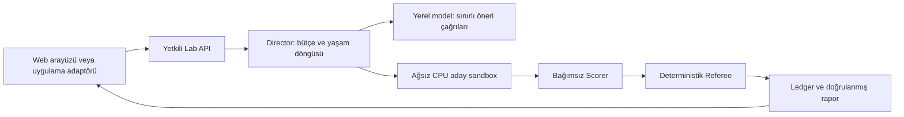

# AI Scientist

Yerel dil modelleriyle çalışan bir AI/ML araştırma laboratuvarı. Saha ekipleri için
veri seçimi, çalışma modu kümeleme, anomali tespiti ve bütçeli hiperparametre
deneylerini bir araya getirir. SWAPP veya AOS kurulumu çekirdeğin bağımlılığı değildir.

**İlk ürün teslimi: v0.1.0 · 2026-10-03.**
Ürün/package sürümü `0.1.0`; yayımlanmış v0.1.0 etiketi iç harness `0.46.0`
kaynağını sabitler. CachyOS üzerinde onaylı CPU güncellemesi sonrasında çalışan
konsol/harness `0.47.0` sürümündedir; mevcut Git etiketi değiştirilmedi.
[Güncel CPU dağıtımı ve sınırları](docs/ai-scientist/129-runtime-package-preflight.md).
[Sürüm notları](docs/releases/v0.1.0.md). Mevcut CachyOS kurulumunda CPU deney
akışı çalışır. Tam M0, temiz makine kurulumu ve AOS ile gerçek GPU birlikte çalışma
kabulü tamamlanmadı. Kod deposu public; proje lisansı henüz seçilmedi.

- [Teslim durumu, testler ve bilinen eksikler](docs/ai-scientist/122-delivery-guide.md)
- [AOS ve uygulamaya özel entegrasyon planı](docs/ai-scientist/123-application-integration.md)
- [v0.1.0 sonrası kontrollü AOS CPU bağlantısı ve sonuç raporu](docs/ai-scientist/125-aos-controlled-cpu-integration.md)
- [Dokümantasyon dizini](docs/README.md)

## Neler yapabilirsiniz?

| Yetenek | Bu sürümdeki durum |
|---|---|
| Sentetik veri üretme ve deney tasarlama | CPU kullanıcı akışında kullanılabilir |
| Yetkili PostgreSQL kaynağından veri seçme | Yapılandırılmış, salt okunur kaynakla; sırlar sunucuda |
| Temel istatistik ve veri kalitesi | Dağılım, korelasyon, otokorelasyon ve eksik veri incelemesi |
| LSH, OPTICS, SOM | Çalışma modu öğrenimi ve hiperparametre denemeleri |
| NN tahmini ve OMR | Mod toleransı, normal değer tahmini, sensör residual ve OMR grafikleri |
| Anomali karşılaştırması | Robust-z, Isolation Forest, ECOD baseline ve aday ölçümleri |
| Uzun OMR akışı | Bütçeli, sonlu CPU akışı; tek fit ve kronolojik parçalar |
| Deney yaşam döngüsü | Başlat, izle, durdur, doğrulanmış rapor ve kalıcı kayıt |
| Araştırma amacı ve hafıza | Varlık/hedef ve açıkça seçilen önceki bulgular öneri bağlamına bağlanır |
| Yerel LLM araştırması | Ayrı yapılandırmada ölçüldü; varsayılan field-lab CPU profilinde kapalı |
| Öğretmen / LoRA / QLoRA | Arayüzde hazırlık taslağı; bu sürümde öğrenilmiş adaptör teslimi yok |
| AOS içinde adil GPU paylaşımı | Kaynak/CPU altyapısı mevcut; gerçek ortak kabul sonraki aşama |

Mod uzaklığı, SOM uzaklık skoru ve OMR farklı ölçülerdir. OMR burada belgelenmiş
residual yaklaşımının uygulamasıdır; AVEVA veya TrendMiner ürün uyumluluğu iddiası
yoktur. [Yöntemler ve kaynaklar](docs/ai-scientist/42-operating-modes-omr-experiments.md).

## Yerel modeller ve Unsloth adaptörleri

Qwen3.8-27B için hazırlık; 16 GB VRAM üzerinde denenmek üzere Qwen3.5-9B ve
Qwen3-8B alternatifleri tanımlıdır. Model başına ayrı LoRA/QLoRA planı; temel
model, tokenizer, eğitim verisi/split, izin, runtime ve değerlendirme hashlerine
bağlanır. CPU planlayıcı hazırdır; bu üç profil için yeni inference bağlantısı
ve gerçek adaptör eğitim yürütücüsü henüz etkin/teslim edilmiş değildir.
27B QLoRA için belgelenmiş en az 24 GB gerekir; mevcut 16 GB makinede eğitim
kabulü verilmez. [Profiller, komutlar ve kalan işler](docs/ai-scientist/130-model-and-adapter-preparation.md).

## Hazır kurulumu açın

Bu komutlar **mevcut hazırlanmış CachyOS kurulumu** içindir. Güncel arayüz ayrı
çalışma ağacındadır; eski ana dizindeki varsayılan başlatıcı farklı kurulumu açar.

```bash
cd /home/cachyos/ai-scientist/data/runtime/omr-v1
bash ops/start-lab.sh --profile field-lab
```

Tarayıcı: **http://127.0.0.1:8789/**. API: `127.0.0.1:8767`.
Açık servisler yeniden başlatılmaz. Komutu normal masaüstü kullanıcısı çalıştırır;
terminal kapatılabilir. Yeniden oturum açınca aynı komutu kullanın.

```bash
bash ops/start-lab.sh --profile field-lab --check
bash ops/start-lab.sh --profile field-lab --stop
```

`--stop` yalnız kendi boşta profilini kapatır. Aktif deney varsa önce arayüzden
**Durdur** isteyin ve doğrulanmış terminal durumu bekleyin. Stop isteğinin
alınması işçinin kapandığını veya GPU'nun bırakıldığını göstermez. Veritabanı ve
raporlar korunur; başka süreçleri kapatmayın.

### Interface language / Arayüz dili

The console opens in **English** by default. Use **Language / Dil** in the
header to select **English** or **Türkçe**. The browser remembers your choice;
if browser storage is unavailable, the choice remains active for that tab.
Changing the language preserves form values and does not start an experiment.
User-entered text, original evidence and raw reports retain their source language.

Arayüz varsayılan olarak İngilizce açılır. Üstteki **Language / Dil** seçicisinden
Türkçe seçilebilir; tercih tarayıcıda saklanır. Dil değişimi form değerlerini
ve deney kayıtlarını değiştirmez.

The light console follows the navy, turquoise and white theme of [UMAY OS](https://umayos.org).
Use **Theme / Tema** for **Light / Açık** or **Dark / Koyu**. Light is the default;
the AOS-inspired dark workspace and language preference are remembered independently.
[Frontend delivery evidence](docs/ai-scientist/review-evidence/frontend-dual-theme-20261003.json).

### Başka bilgisayardan erişim

Kurulmuş özel erişim köprüsünün adresi kurulum sorumlusundan alınır. SSH ile
tek komutta **CPU profilini açmak, tünel kurmak ve tarayıcıyı açmak** için Mac/Linux
istemcide güncel `ops/connect-lab.sh` dosyasını çalıştırın:

```bash
bash ops/connect-lab.sh --host CACHYOS_SSH_HOST --user cachyos \
  --remote-dir /home/cachyos/ai-scientist/data/runtime/omr-v1 \
  --profile field-lab
```

Yerel adres **http://127.0.0.1:8788/** olur; SSH tüneli uzak CPU konsolunun
`127.0.0.1:8789` portuna gider. Açık servisler yeniden başlatılmaz. Bu profil
GPU/model çağrılarını açmaz. Terminal açık kalmalı; Ctrl+C yalnız bu scriptin
SSH tünelini kapatır, çalışan Lab ve deneyler devam eder. SSH erişimi/hesabı
önceden kurulmuş olmalıdır; API anahtarı tarayıcıya veya URL'ye konmaz.

- Yerel port doluysa `--local-port 8790` seçin.
- Profil zaten açıksa ve yalnız tünel isteniyorsa `--no-start-lab` ekleyin.
- Tarayıcıyı kendiniz açmak için `--no-browser` ekleyin.
- Windows eşdeğeri `ops/connect-lab.ps1 -HostName CACHYOS_SSH_HOST -RemoteDir /home/cachyos/ai-scientist/data/runtime/omr-v1 -LabProfile field-lab` olur.

Profil seçilmezse önceki launcher ve uzak 8788 portu korunur. Yalnız tünel için
manuel alternatif: `ssh -N -o ExitOnForwardFailure=yes -L 127.0.0.1:8789:127.0.0.1:8789 CACHYOS_SSH_HOST`,
ardından `http://127.0.0.1:8789/`. Uzak Mac/Windows tarayıcısı ile gerçek SSH
kabulü bu hostta yapılmış sayılmaz; PowerShell çalıştırma ortamı burada yoktur.

## İlk deneyi görün ve kendiniz deneyin

1. **Eylemci** ekranında bağlantının hazır olduğunu kontrol edin.
2. **Saha araştırma amacı** bölümünde varlık, dijital ikiz/kestirimci bakım hedefi
   ve araştırma sorusunu yazın. Varlık etiketi kullanıcı beyanıdır.
3. Veri ve yöntem seçimine geçin. İlk kendi denemenizde küçük sentetik veri,
   tek OPTICS yapılandırması ve baseline dahil 600 saniye bütçe kullanın. Veri
   istatistiklerini inceleyin. Sentetik snapshot oluşturduktan sonra **Scorer için
   hazırla** düğmesine basıp hazır durumunu bekleyin.
4. Deneyi başlatın; **Deneyler** üzerinden durumunu takip edin. Sonuçta OMR,
   sensör değerleri, NN referansı ve residual katkılarını inceleyin.
5. Raporu indirin. **Deney hafızası** ekranında doğrulanmış referansları görün;
   isterseniz bulguları sonraki deneye açıkça seçerek aktarın.

Hazır kurulumdaki tamamlanmış saha amacı örneği:
`50ea6463-4589-4213-a2fe-817287f3a323`.
SKAB DEV kesitinde **279,61 saniyede 12 bağımsız skor** üretildi: 9 baseline,
1 OPTICS aday ve 2 teyit. 470 OMR noktası ve 8 sensör gösterilir. OPTICS KEEP
kararı aldı; ham VUS-PR `0.59051`, en iyi baseline `0.59544` olduğundan bu örneği
baseline üstünlüğü veya genel öğrenme olarak sunmuyoruz.
[Deney ve cleanup kanıtı](docs/ai-scientist/121-field-intent-workflow.md).
Bu kayıtlar kaynak kodla birlikte dağıtılan canlı veritabanı değildir.

## Mimari ve kaynaklar



Python 3.12, FastAPI, PostgreSQL, Docker sandbox ve React arayüzü kullanılır.
Aday etiketleri görmez; KEEP/DISCARD kararını dil modeli vermez. Kimlik,
owner/generation, idempotency, bütçe ve quarantine kontrolleri korunur.

Mevcut host yaklaşık 32 GB RAM / RTX 4070 Ti SUPER 16 GB VRAM'dir. Field-lab
CPU profilinin bileşen toplam CPU tavanı **5,5 çekirdek**; host RAM rezervi
**6 GiB**, disk rezervi **20 GiB**. Bunlar ölçülmüş tüketim değildir. GPU modeli
bu profilde açılmaz. AOS ve Scientist için tek ortak tahsis otoritesi korunur;
yeni donanımda paralellik ölçüm ve kaynak admission ile artırılır.

## Geliştirici kurulumu ve doğrulama

Kaynak/CPU geliştirme ortamını oluşturmak için Python 3.12, uv ve Node.js/npm:

```bash
uv sync --extra dev --frozen
cd console/web
npm ci
npm run build
cd ../..
PATH="$PWD/.venv/bin:$PATH" .venv/bin/python scripts/quality_gate.py
```

v0.1.0 için hazır host üzerinde **yeni, izole Python ortamına kurulum doğrulandı**:
Python 3.12.13, frozen/offline uv kurulumu, 63 paket, import/CLI/bağımlılık
kontrolleri başarılı. Bu ölçüm Docker, Node/UI veya temiz makine kabulünü kapsamaz.
[Kurulum kanıtı](docs/ai-scientist/review-evidence/v010-fresh-python-install-20261003.json).

Bu komutlar tek başına tam Lab çalışma ortamı oluşturmaz. Servis çalıştırmak
Linux kullanıcı systemd oturumu, Docker erişimi, pinli yerel imajlar ve özel
profil yapılandırması gerektirir. `ops/start-lab.sh --profile NAME --prepare`
yalnız özel yapılandırmayı hazırlar; eksik imajı/modeli indirmez. Temiz makine
uçtan uca kurulum kabulü açık olduğu için hazırlanmış host akışı ile taşınabilir
kurulumu ayrı tutuyoruz. [Önkoşullar ve sorun giderme](docs/ai-scientist/122-delivery-guide.md).

0.46 ürün kaynağının son tam kapısı: **3328 passed, 7 skipped, 177 deselected**;
yedi komut gerçek exit `0`. GPU/live testler bu kapının dışındadır. Gerçek
masaüstü/mobil arayüz okuması, tek deney kabulü, idempotent retry, terminal rapor
ve 12 Scorer/Director cleanup ayrıca doğrulandı. Sonraki yayın yardımcılarının
sonuçları teslim kılavuzunda ayrıca kaydedilir.

Teslim paketi ayrıca **3439 passed / 49 skipped / 177 deselected** ile
doğrulandı. İlk servis ortamında eksik `uv` yolu düzeltildikten sonra aynı
kaynağın wheel build/import kontrolleri tamamlandı; yedi kontrol exit `0`.
[Son paket kontrolü ve açık kabuller](docs/ai-scientist/review-evidence/release-046-delivery.json).

## Öğrenme, veri ve lisans sınırları

Her deney ölçüm ve köken kaydı bırakır. Geçmiş bulguyu sonraki öneride kullanma
çalışır; her koşuda otomatik kalıcı gelişme veya daha iyi model garantisi yoktur.
Ana eylemci yerel modeldir; öğretmen isteğe bağlı fikir/model/mimari desteğidir.
Öğretmen yerel veya her çağrı için açık onayla harici API olabilir; mevcut ekran
yalnız destek/eğitim taslağı indirir, çağrı/eğitim backend’i henüz yoktur.
[Çalışma döngüsü ve topoloji](docs/ai-scientist/127-local-agent-and-teacher.md).
[Public DEV yerel araştırma hazırlığı](docs/ai-scientist/128-public-dev-local-agent.md)
ayrı veri/profil izni gerektirir; mevcut CPU profili model başlatmaz. Eğitim izni olmayan
saha amacı ve ham bağlam SFT dışa aktarımında dışlanır. Öğrenilmiş adaptör,
bağımsız değerlendirme ve otomatik terfi sonraki aşamadır.

Güncel veri profili **ticari olmayan araştırma**. Genesis, GECCO, CATSv2 ve
SMD seçiminde SMD sunucu telemetrisidir. GHL/SWaT ek izin olmadığı için dışarıdadır.
Her kaynak/veri/model lisansı ayrı izlenir; public repo özel verilerin veya model
ağırlıklarının yayın izni değildir. Proje lisansı kararı açık kalır.

<!-- api-cost-summary:start -->
## Hypothetical API cost / Varsayımsal API maliyeti

**USD 2,988.64** — Standard short-context API scenario; not an actual bill.
Last observed UTC / Son gözlem UTC: **2026-10-03T19:59:59.533000+00:00**.

Observed / Gözlenen: **5,570,314,642** tokens; priced / fiyatlandırılan: **5,570,233,663**; unpriced / fiyatlandırılamayan: **80,979**.
Separate local runtime / Ayrı yerel runtime: **8,278** tokens; excluded from this cloud estimate.

Actual API billing and subscription charges are unknown. Gerçek API faturası ve abonelik bedeli bilinmiyor; bu tutar varsayımsaldır.
Coverage is incomplete; unknown cost is not zero. Kapsam eksiktir; bilinmeyen maliyet sıfır değildir.

[Hourly details / Saatlik ayrıntılar](docs/usage/project-usage-latest.md) · [Latest JSON / Güncel JSON](docs/usage/project-usage-latest.json) · [Dated calculation / Tarihli hesap](docs/ai-scientist/131-api-cost-summary.md)
<!-- api-cost-summary:end -->

## Geliştirme süresi, token ve maliyet

Geliştirme oturumları ve uygulamanın yerel model tüketimi ayrı raporlanır.
Gerçek fatura/abonelik belgesi yoktur; gerçek ücret **bilinmiyor**. API tarifesiyle
hesaplanan senaryo yalnız varsayımsal karşılıktır. Kayıt kapsamı başlangıçtan bugüne
eksiksiz fatura toplamı değildir. [Kullanım raporu](docs/usage/project-usage-latest.md) ve
[kayıt/yayın işleyişi](docs/usage/README.md).

Güncel tercih Astra/high orkestrasyon, çoğunlukla Sol 6.1 ve göreve göre effort.
Aşağıdaki fiili model listesi metadata gözlemidir; talep edilen model fiilen
çalışmış gibi kaydedilmez. Goal tokenı, API tokenı ve fatura birbirine eklenmez.

<!-- development-metrics:start -->
Sayaç güncellemesi: **2026-10-03 23:45:26 Europe/Istanbul**.

| Ölçüm | Değer |
|---|---:|
| Güncel goal dönemi aktif süre | 41 saat 6 dakika 56 saniye |
| Güncel goal dönemi aktif süre (saniye) | 148016 |
| Güncel goal dönemi token | 38191620 |
| Güncel goal dönemi takvim süresi | 62.358056 saat |
| Kaydedilen dönem sayısı | 2 |
| Kaydedilen dönemlerin toplam aktif süresi | 112.951667 saat |
| Kaydedilen dönemlerin toplam aktif süresi (saniye) | 406626 |
| Kaydedilen dönemlerin toplam tokenı | 140393438 |

Goal aracının raporladığı sayaçlar. Faturalandırma miktarı veya insan işçiliği değildir; alt ajan/cache hesaplama kapsamı araç tarafından açıklanmıyor.
Toplam, aynı oturumun her goal dönemi için son gözlenen sayaçların toplamıdır; ardışık snapshot'lar ve tekrarlar toplanmaz. Tarihsel gözlemlerin kapsamı eksiktir; gözlenmeyen dönemler veya son gözlemden sonraki kullanım bilinmez.

| Model | Ayar | Rol | Gözlenen oturum |
|---|---|---|---:|
| gpt-6-astra | high | Teknik orkestrasyon ve mimari inceleme | 23 |
| gpt-6-astra | max | Ana oturum orkestrasyonu ve kritik düzeltme/inceleme işleri | 7 |
| gpt-6-astra | xhigh | Ana Codex oturumu | 3 |
| gpt-6-luna | high | İlk uygulama ve odaklı doğrulama işleri | 7 |
| gpt-6-sol | high | Kodlama, entegrasyon ve inceleme işleri | 2 |
| gpt-6.1-sol | high | Rol doğrulanmadı | 21 |
| gpt-6.1-sol | medium | Kalan teknik orkestrasyon, uygulama ve inceleme | 41 |
| gpt-6.1-sol | xhigh | Rol doğrulanmadı | 3 |

Bu taramada ilişkili oturum: 102.

[Sayaç ve köken kaydı](docs/development-metrics.json).
<!-- development-metrics:end -->

Sayaçlar `scripts/update_development_metrics.py` ile anlamlı teslimatlarda
güncellenir. Ham oturum metinleri ve özel snapshot'lar yayımlanmaz.

## Sonraki aşama

1. AOS adapter/producer/consumer bağlantısı ve aynı sürümde kaynak/config teyidi.
2. Tek scheduler ile kısa gerçek GPU devir, iptal/toparlanma ve temiz kapanış kabulü.
3. Uygulamaya özel yetki, varlık/sensör/zaman eşlemesi ve saha geri bildirim akışı.
4. Öğretmen işi, uygun eğitim kayıtları, adaptör değerlendirme ve kontrollü terfi.

[Uygulama entegrasyonu ve bitti ölçütleri](docs/ai-scientist/123-application-integration.md).
Özgün M0/OM maddeleri [kabul kaydında](docs/ai-scientist/m0-acceptance.md) korunur;
bu teslim kalan araştırma/kapasite kabullerini tamamlanmış saymaz.

AOS sonraki kaynak adayı: [deney özeti sözleşmesi ve kalan entegrasyon işleri](docs/ai-scientist/126-aos-next-source-handoff.md). Bu aday canlı sürüme dağıtılmadı.
