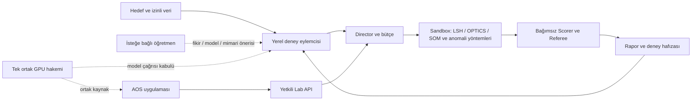

# Yerel deney eylemcisi, öğretmen desteği ve topoloji

## Ana çalışma döngüsü

Ana araştırmacı **yerel dil modeli**dir. Kullanıcı saha hedefini ve izinli veriyi
seçer. Model yöntem/hiperparametre önerir; Director bütçe ve deneyi yönetir.
Sandbox algoritmayı yürütür, bağımsız Scorer ölçer, Referee öneriyi değerlendirir.
Doğrulanmış sonuç özeti sonraki yerel öneriye geri beslenir.

Model kendi başarısını puanlamaz. Ham seri/gizli etiketler ve holdout bilgisi
araştırma prompt'una verilmez; izinli, doğrulanmış geliştirme sonuçları özetlenir.
Sonuçlardan sonraki öneriye uyarlama yapılması model ağırlıklarının eğitildiği
anlamına gelmez. Önceki koşuların bulguları açık seçimle yeni bağlama eklenir.

## Öğretmen ayrı ve isteğe bağlıdır

Öğretmen büyük bir yerel model veya açık onayla harici API olabilir. Amaçlar:

- Deney fikri veya araştırma planını incelemek.
- Model/yöntem iyileştirmesi önermek.
- Mimari değişikliği önermek.
- İzinli eğitim verisi, LoRA/QLoRA ve bağımsız değerlendirme planı hazırlamak.

Harici çağrı öncesinde hedef sağlayıcı/model, gönderilecek içerik ve bütçe
açıkça gösterilmeli; her çağrı için onay alınmalıdır. Ana deney eylemcisi yerel
kalmaya devam eder. Öğretmen önerileri otomatik kod/mimari dağıtımı, veri paylaşımı
veya model terfisi değildir; değerlendirme ve onaylı uygulama ayrı aşamalardır.

## Mevcut kurulumun dürüst durumu

- Yerel model ile sınırlı öneri/ölçüm döngüsü kaynakta vardır; geçmiş gerçek
  [altı önerili koşu](118-six-proposal-local-research.md) kayıtlıdır.
- Açık `field-lab` profili şu anda CPU içindir: model çağrıları kapalıdır.
  Elle seçilmiş grid çalışır; yerel model tasarımı olarak etiketlenmez.
- Öğretmen bölümü destek/eğitim taslağı hazırlar. Yerel/harici öğretmen çağrı
  backend'i, uygulanmış mimari değişikliği ve eğitilmiş adapter henüz yoktur.
- AOS kontrollü CPU akışı ölçüldü; web bağlam aktarımı geliştiriliyor.
  Gerçek ortak GPU akışı ve finite shared-unit başlatma yetkisi açık.

Arayüz topolojisi bu rollerin yanında güncel çalışma/kapalı/taslak durumunu
gösterir. Tasarım diyagramı bütün yolların çalışır kabulü değildir.

## Canlı arayüz teslimi — 2026-10-03

Eylemci ekranındaki **Sistem nasıl çalışır?** bölümü yedi adımlı döngüyü,
AOS kontrol API bağlantısını ve tek ortak GPU hakemini gösterir. Öğretmen
hazırlığı varsayılan olarak kapalı ayrı bir bölümdür. Yerel eylemci ve manuel
CPU karşılaştırması ayrı seçimlerdir; desteklenmeyen veri yolunda sessizce
manuel çalışmaya geçilmez.

Yalnız ön yüz dosyaları ve derlenmiş statik içerik güncellendi; API yeniden
başlatılmadı. TypeScript/Vite derlemesi ve canlı localhost arayüzünde Playwright
kontrolleri geçti: 1440×1050 masaüstü, 390×844 mobil, yedi akış adımı, eylemci/grid
seçimi ve onaysız/çalıştırılmamış dış öğretmen JSON taslağı. Sayfa hatası ve mobil
yatay taşma görülmedi. Doğrulama yalnız okuma yaptı; deney veya model çağrısı
başlatmadı. Browser eklentisi bulunmadığından mevcut Playwright kullanıldı.
Aserdargun bilgisayarının kendi tarayıcısındaki erişim bu kontrolde doğrulanmadı.
