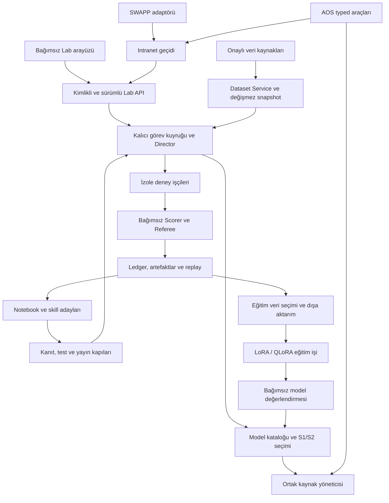

# Açık kaynak AI/ML laboratuvarı: mimari ve teslim planı

Tarih: 2026-09-27. Kaynak: kullanıcının açık kaynak yayın, intranet üzerinde
SWAPP + AOS entegrasyonu, sürekli gelişim, model/yöntem değiştirme, skill
üretimi ve ileride LoRA/QLoRA eğitimi için kayıt biriktirme talebi.

Kullanıcının sonraki açıklaması: genel proje bağımsız yayımlanacak;
SWAPP şirkete özgü private intranet web uygulamasıdır. Kullanıcı kendi
fork'unda SWAPP + AOS entegrasyonunu yapacak; başka kullanıcılar farklı
uygulama ve ajan birleşimleri seçebilecek.

**Durum:** hedef mimari ve uygulanacak işler. Bu belge bir tamamlanma kanıtı
değildir. [M0 kabul kaydı](m0-acceptance.md) ve
[çalışma modu kapsamı](42-operating-modes-omr-experiments.md) geçerlidir.
Orijinal spec korunur; aşağıdaki sıra yeni ürün yönüne göre güncellenmiştir.

## 1. Ürün sınırı

AI Scientist bağımsız kurulabilen bir araştırma servisidir. Kendi arayüzü,
veritabanı, deney işçileri, model bağlantıları ve raporları vardır. Genel
çekirdek herhangi bir şirket uygulamasına veya tek bir ajan sistemine
bağımlı olmaz. SWAPP veri bağlamı ve AOS orkestrasyonu özel fork'un bir
entegrasyon senaryosudur. Uygulamalar aynı makinede veya intranet içinde
ayrı servisler olabilir; birinin kapanması diğerlerini kullanılamaz yapmaz.

Claude ile geliştirme/entegrasyon yapılabilir. Claude'un ürün içinde model
olarak da kullanılması kullanıcıya soruldu; yanıt gelene kadar mevcut
**yerel araştırma modeli** şartı korunur. Model sağlayıcı arayüzü genişlemeye
uygun olur; dış servis erişimi bu planla kendiliğinden açılmaz.

## 2. Bugünkü koddan başlayan sınırlar

| Alan | Mevcut dayanak | Tamamlanması gereken |
|---|---|---|
| Deney yaşam döngüsü | `lab/director`, kalıcı bütçe/nesil/checkpoint; `lab/api` | Gerçek kesinti/devam, uzun yerel model koşusu ve kalan M0 kabulleri |
| Veri ve yöntemler | `lab/analytics`, `lab/operating_modes`, public yükleyiciler | Onaylı intranet kaynak adaptörleri ve uzun kampanyalar |
| Model çalıştırma | `lab/llm/native_runtime.py`, `lab/director/local_llm.py`, ortak GPU kuyruğu | Genel model kataloğu, ölçülmüş uygunluk ve model değişim akışı |
| Kanıt ve kayıt | `ExperimentDocument`, `TrajectoryDocument`, içerik hash'leri, `lab/replay.py` | Eğitim ihracı için sürümlü kayıt tamlığı ve uygunluk doğrulaması |
| Eğitim | `lab/training` bakım/işçi kodu | Seçilmiş veri paketi → adapter → bağımsız değerlendirme zinciri |
| Bilgi ve skill | Spec §3.5–3.6 tasarımı | Ürün içi notebook, skill deposu ve yayın kapıları henüz yok |
| Açık kaynak dağıtım | Kaynak ağacı, bağımlılık kilidi, testler | Kök lisans seçimi, temiz dağıtım, taşınabilir kurulum ve yeni makine testi |
| Dış uygulamalar | Lab API ve ayrı AOS entegrasyon çalışma alanı | Genel adaptör sözleşmesi ve intranet kimliği; AOS referans testi; SWAPP adaptörü özel fork'ta |

Mevcut `trajectory.v1` model/adapter/örnekleme, veri lisansı ve kaynak kökeni,
mesaj blob'u, karar ve replay bağlarını taşır. Bu alanların varlığı,
kayıtların doğrudan eğitime veya açık yayına uygun olduğunu kanıtlamaz.
Mevcut `noncommercial_research` kayıtları geriye dönük yeniden etiketlenmez.
Üretim kayıtlarında temizleme alanları henüz `false`, kalite etiketi
`bronze` olarak başlar. Eğitim paketi bunları doğrulanan temizlik ve uygunluk
kanıtıyla türetir; özgün ledger kayıtlarını değiştirmez. `adapter` alanındaki
mevcut `vllm-local` çalışma motorunu anlatır; LoRA artefakt hash'i için ayrı
türlü bir alan gerekir. Mevcut eğitim işçisi sentetik veri kullanır ve
adapter kaydetmez; model geliştirme zinciri henüz tamamlanmış değildir.

Salt okunur ilk gerçek kayıt incelemesi üç tamamlanmış CPU projesindeki
**12 deney/trajectory çiftini** üretim rapor okuyucusuyla doğruladı;
mesaj blob hash'leri de kontrol edildi (session 80701 / exit 0).
Bu kayıtlar temizlenmiş eğitim paketi olarak doğrulanmadı, ihracat yapılmadı.
[Eğitim kayıt hazırlığı](review-evidence/training052-record-readiness.json).

## 3. Bağımsız kurulum ve intranet entegrasyonu

- Dağıtım birimi genel Lab çekirdeği + isteğe bağlı SWAPP/AOS adaptörleri
  olur. Çekirdek bu uygulamaları import etmeyi veya kurulu olmalarını şart
  koşmaz. Yerel kurulum için ilk giriş `ops/start-lab.sh` olur; bugün bu
  başlatıcı mevcut makinenin kayıtlı kurulumuna bağlıdır.
- Taşınabilir kurulum; örnek yapılandırma, ilk özel kimlik oluşturma,
  migration, veri/artefakt dizinleri, kaynak profili ve sürüm yükseltme/
  yedekten geri dönüş adımlarını içerir. `/home/cachyos` ve mevcut bootstrap
  dizini genel paketin zorunlu yolu olmaktan çıkarılır.
- Açık çekirdek; genel snapshot, iş, yöntem, model, skill ve rapor
  sözleşmelerini sahiplenir. SWAPP endpoint/iş alanı/kurumsal yetki eşlemeleri
  kullanıcının özel fork'unda kalır. Genel adaptör örneği sentetik servisle
  test edilebilir; SWAPP deposu veya intranet erişimi gerektirmez.
- Mevcut loopback servisleri korunur. Intranet erişimi ayrı TLS geçidi,
  servis kimliği, kullanıcı/rol eşlemesi, kota ve denetim kaydıyla açılır.
  Portu `0.0.0.0` yapıp yerel bearer token'ı paylaşmak dağıtım modeli olmaz.
- API sözleşmesi: yetenekleri listeleme, veri kaynağı/snapshot seçimi,
  bütçeli deney/kampanya başlatma, durum/ilerleme, desteklenen devam,
  durdurma ve doğrulanmış rapor/artefakt alma. Idempotency, owner ve
  `external_origin` kimlikleri korunur; sürüm uyumsuzluğu açık yanıt verir.
- AOS kısa araç çağrısından dış iş kimliği alır. Uzun araştırma foreground
  scheduler slotunu tutmaz. SWAPP için de bağlantı kesilmesi araştırma
  süresini sıfırlamaz; tekrar bağlanma aynı kalıcı işe döner.
- Veri sorguları onaylı kaynak, alan, varlık ve zaman aralığına bağlıdır.
  Dataset Service salt okunur erişir ve snapshot üretir; aday koduna DB
  erişim bilgisi verilmez. Toplu veri çekimi SWAPP kontrol API'sini yüklemez.
- Aynı host'ta toplam CPU/RAM/disk bütçesi ve model çağrısı düzeyinde adil
  GPU paylaşımı zorunludur. Uzun eğitim ayrı, sınırlı bakım işi olarak
  yürür; araştırma ve AOS kaynak ölçümleri bu işten ayrı raporlanır.

## 4. Model, yöntem ve skill değiştirme

### Model kataloğu

Her profil model/revision/dosya hash'leri, tokenizer ve chat şablonu,
nicemleme, adapter/base-model uyumu, runtime sürümü, lisans/erişim profili,
S1/S2 yetenekleri, tool şeması ve ölçülmüş RAM/VRAM/bağlam sınırlarını taşır.
LLM sağlayıcısı ile deneyde kullanılan ML algoritması farklı kayıtlardır.

Director görev için kaynaklara uygun **doğrulanmış** profil seçer. Yeni model
önce tanı, araç uyumu ve aynı görevlerde karşılaştırma denemelerinden geçer.
Kazanç; başarı, hata, süre, token, bellek ve bağımsız değerlendirmeyle ölçülür.
Model indirildi veya yüklendi diye varsayılan yapılmaz.

Bir araştırma koşusunun model/program/skill/politika sürümü dondurulur.
Model değişimi, açık deneyler tamamlandıktan sonra yeni `agent_version` ve
yeni bağlı koşu oluşturur. Kampanya bu koşuları ilişkilendirir. Çöken koşuyu
devam ettirmek model veya bütçe değiştirme yolu değildir. Önceki doğrulanmış
profile geri dönüş ve değişim nedeni kayda alınır.

### Yöntem arama

Mevcut LSH/OPTICS/SOM → mod toleransı → NN tahmini → sensör residual/OMR
akışı korunur. Detector, özellik, ön işleme, füzyon ve alarm politikası
önerileri ortak `fit/score` veya `fit/assign` sözleşmelerinden geçer.
Yeni yöntem mevcut causal, deterministik, izolasyon ve Scorer kapılarını
geçer; kendi değerlendirme kuralını değiştiremez. Kampanya bütçesi ve
plato/EXPLORE/END davranışı uzun çalışmanın durma koşullarını tanımlar.

### Skill yaşam döngüsü

İki tür: çalıştırılabilir kod ve okunabilir prosedür. Paket;
`SKILL.md`, makine manifesti, kod, test, bağımlılık/lisans listesi ve deney
kanıtlarını içerir. `candidate → validated → published → deprecated`
durumları sürümlüdür. Spec G-S1–4 korunur: yapısal/izolasyon kontrolleri,
yeniden kullanım veya ablation faydası, bağımsız holdout ve reviewer onayı.
Otomatik üretim aday yaratır; yayımlanmış skill indeksini doğrudan yazmaz.
Yeni indeks agent sürümünü değiştirir. Claude Code/Codex için taşınabilir
paket, ürün içi çalışma izinlerinden ayrı bir dışa aktarım hedefidir.

## 5. Bugünden biriktirilecek eğitim kayıtları

Kayıt tamlığı M6'ya ertelenmez. Mevcut değişmez v1 kayıtları okunmaya devam
eder; yeni alanlar sürümlü ek sözleşmeyle, geriye uyumlu okuyucuyla eklenir.
Eski kayıtta bulunmayan alan tahmin edilmez; eksikliği dışlama nedeni olur.

| Kayıt grubu | Zorunlu köken ve içerik |
|---|---|
| Kimlik | Kampanya/run/deney/parent, owner, işlem ve tekrar kimlikleri, UTC zamanlar |
| Yeniden üretim | Snapshot/split, kod/diff/commit, harness/image, seed, bağımlılık kilidi, parametreler |
| Ajan | Agent/model/revision/adapter, şablon, örnekleme, skill indeksi, notebook/politika sürümü |
| Gözlenebilir etkileşim | Modele verilen izinli bağlam, görünen yanıt, hipotez, yapılandırılmış gerekçe, araç çağrısı/sonucu, onarım geçmişi |
| Sonuç | Bağımsız skor, guard, Referee kararı, belirsizlik, holdout durum makbuzu, rollback ilişkisi |
| Maliyet ve arıza | Süre/token/kaynak ölçümleri; aday, altyapı, policy, iptal ve timeout nedenleri ayrı |
| Haklar ve uygunluk | Veri/kod/model/skill kaynakları ve lisansları, kullanım profili, eğitim ve paylaşım uygunluğu, dışlama nedenleri |

Gizli model iç muhakemesi kayıt şartı değildir. Eğitim için gerekli olan,
uygulamanın gözleyebildiği girdiler, çıktılar, eylemler ve doğrulanmış
sonuçlardır. Ham sensör dizileri, erişim bilgileri ve holdout/sealed/REB
içeriği eğitim bağlamına alınmaz. Yerel denetim kaydı ile temizlenmiş eğitim
paketi farklı erişim ve saklama politikaları taşır.

İhracatçı; SFT, KTO, gerçek kardeşlerden DPO ve critic veri paketlerini
manifest/veri kartı/hash ile üretir. Başarısız deneyler denetim için kalır;
altyapı hatası, iptal veya gürültü içindeki fark otomatik negatif eğitim
örneği olmaz. Sonradan geri alınan şampiyonun bağlı örnekleri uygunluktan
çıkarılır. DPO için aynı parent ve kanonik bağlam zorunludur.

Train/validation/test ayrımı aile, kaynak ve zaman kökeniyle yapılır;
aynı deneyin veya normalize diff'in kopyaları iki bölüme sızmaz. Uygunluk ve
ayıklama kuralları sürümlenir; her dışlama raporlanır. NC veri kaynakları
ticari kullanıma hazır paket diye sunulmaz; kayıt toplama açık yayın
yetkisi olarak yorumlanmaz. Spec'teki örnek sayısı eşikleri kalite ve
çeşitlilik incelemesiyle birlikte uygulanır.

## 6. LoRA/QLoRA ve ölçülen gelişim döngüsü

`deney → doğrulanmış bulgu → skill/veri adayı → değerlendirme → yeni sürüm`
döngüsü kurulur. Eğitim, sürümlü veri paketini, base model/tokenizer
hash'ini ve tam ayarları tüketen ayrı bir iştir. Üretilen adapter model
kartı, kaynak lisansları, eğitim/veri hash'leri, optimizer/checkpoint
kimliği ve gerçek bellek/süre ölçümüyle kataloglanır.

Yeni adapter önce yükleme ve araç uyumu, sonra tutulmuş görevlerde temel
model karşılaştırması ve REB/ablation'dan geçer. Araştırma verimliliği,
çeşitlilik ve kaynak maliyeti izlenir; kendi eğitim örneklerinde başarı
gelişimin kanıtı sayılmaz. Başarısız adapter etkinleştirilmez, önceki
doğrulanmış sürüm kullanılabilir. M0 QLoRA fizibilite ölçümü ile M6 gerçek
adaptör kalitesi kabulü ayrı kalır.

## 7. Açık kaynak yayın paketi

- Genel çekirdek, adaptör sözleşmeleri, sentetik üreticiler ve taşınabilir
  testler yayın paketine girer. Kuruma özgü bağlantılar örnek yapılandırma
  ile anlatılır; gerçek DSN/token, yerel veritabanı, ham veriler, model
  ağırlıkları ve özel çalışma kayıtları pakete alınmaz.
- Repo kökünde proje lisansı henüz yok. Lisans/katkı politikası kullanıcıyla
  kesinleştirilir; üçüncü taraf bildirimleri ve veri/model lisansları ayrı
  envanterde tutulur. Kaynak kod lisansı veri ve adapter haklarını değiştirmez.
- Mevcut `review-evidence` dizini otomatik yayınlanacak kabul edilmez.
  Dosya içeriği ve Git geçmişi; sır, kurum bilgisi ve yeniden dağıtım
  uygunluğu yönünden incelenir. Temiz sürüm arşivi için açık dosya listesi
  ve hash manifesti üretilir; yerel geçmiş silinmez veya yeniden yazılmaz.
- README, hızlı başlangıç, mimari, API sürümleme, katkı/test rehberi,
  SECURITY iletişim yolu, üçüncü taraf bildirimleri, migration ve geri
  dönüş rehberi release'e dahil edilir. Remote/kimlik ve son yayın kararı
  sağlanmadan depo oluşturuldu/yayımlandı kabulü verilmez.
- Temiz makine kabulü: yalnız yayın paketi + belgelenmiş bağımlılıklar ile
  sentetik veri üret → deney başlat → raporu aç → yeniden başlat → kaydı
  tekrar oku. Gizli yerel fixture veya geliştirme dizini bağımlılığı olmaz.

## 8. Uygulama sırası ve kabul kanıtları

| Sıra | Teslimat | Tamamlanma kanıtı | Durum |
|---|---|---|---|
| L0 | Çalışan çekirdek: kalan M0/OM işleri | Gerçek resume, sandbox denetimi, public araştırma/holdout, yerel S1/S2, eğitim fizibilitesi, AOS birlikte ilerleme | Sürüyor; M0 10 geçti / 8 kısmi / 4 açık |
| L1 | Taşınabilir bağımsız kurulum + eğitim kayıt sözleşmesi | Temiz kurulum senaryosu; gerçek geçmiş kayıtta tamlık/eksik alan raporu; yeni deneyde gerekli köken | Planlandı; yerel başlatıcı mevcut |
| L2 | Genel intranet/adaptör sözleşmesi | Bağımsız örnek istemci ve AOS referansından yetkili start/status/stop/report; bağlantı kesilmesi/idempotency; ayrı yetki/DB; eşzamanlı kaynak ölçümü | AOS kısmi, genel geçit planlandı; SWAPP özel fork'un işi |
| L3 | Model kataloğu ve yöntem kampanyası | İki yerel modelde aynı görev karşılaştırması; kaynak uygunluğu, sürüm değişimi ve geri dönüş; LSH/OPTICS/SOM+AD kampanyası | Genel model değişimi açık |
| L4 | Notebook ve skill üretimi/yayın | İki aileden yeniden kullanım/ablation; G-S1–4; zehirli skill reddi; indeks ve agent sürüm bağı | Planlandı |
| L5 | Eğitim paketi ve LoRA/QLoRA döngüsü | Lisans/dışlama/dedup/split kanıtı; SFT/KTO/DPO ihracı; gerçek adapter eğitimi, temel modele karşı REB, rollback | Planlandı; bakım işçisi mevcut |
| L6 | Açık kaynak release | Lisans kararı, temiz paket/geçmiş incelemesi, doküman/CI, temiz makine testi, sürüm/PR/yayın kaydı | Planlandı |

L1'in kayıt tamlığı ve yayın dosya sınırları L0 sürerken hazırlanır; deney
kayıtlarını ileride yeniden üretmek zorunda kalmayız. Kullanılabilir
çekirdek ilk release olabilir; L3–L5 hazır olmadan bu yetenekler tamamlandı
diye duyurulmaz. Önceki M1–M6'nın genel araştırma/skill/eğitim kabulleri
korunur. SWAPP'a özgü veri ve backend/frontend kabulleri özel entegrasyon
profiline aittir; açık çekirdeğin kurulumu bunlara bağımlı tutulmaz. Mevcut
M0 AOS birlikte çalışma kabulü referans entegrasyon olarak ayrıca korunur.

### Sıradaki somut işler

1. 0.36.3 çalışan çekirdeği koru; tamamlanan CPU kesinti/devam kanıtı
   `resume054-verification.json` içindeki 38 kontrolle bağlıdır. Bu koşu
   29 gerçek skor ve 23 terminal kayıt çifti içerir; provider tamamlanması
   ile bütçe mutabakatı arasındaki kesinti sınırı gerçek koşuda ölçülmedi.
2. 053'ün dar stop kapanışı 0.36.3'te doğrulandı; önceki resume başarısızlığı
   korunur. Güncel Docker gözlemcisinin sayısal uyumluluk ve güvenlik
   denemesini tamamla; fixture kimliği hatası gerçek model başarısı sayılmaz.
3. Kalan sandbox denetimi ve gerçek public/holdout zinciri; GPU/AOS
   koordinasyonu hazır olduğunda orijinal gerçek model kabullerini çalıştır.
4. `trajectory.v1` ve provider receipt'leri için eğitim kayıt tamlığı
   envanteri; sürümlü ek kayıt ve salt okunur uygunluk raporunu hazırla.
5. Genel kurulum yapılandırması ve yayın dosya envanteri; ardından model
   kataloğu, skill ve exporter işlerini bu sözleşmelere göre uygula.

Kullanıcının son tercihiyle kalan teknik orkestrasyon, uygulama ve inceleme
GPT-6.1 Sol/medium ile yürür. Birbirinden bağımsız işler paralel, migration/dağıtım ve
paylaşılan donanım deneyleri sıralı yürür. SWAPP veya canlı AOS üzerinde
değişiklik bu plan kaydıyla yapılmış sayılmaz; entegrasyon kopyası ve
koordinasyon kuralları devam eder.
